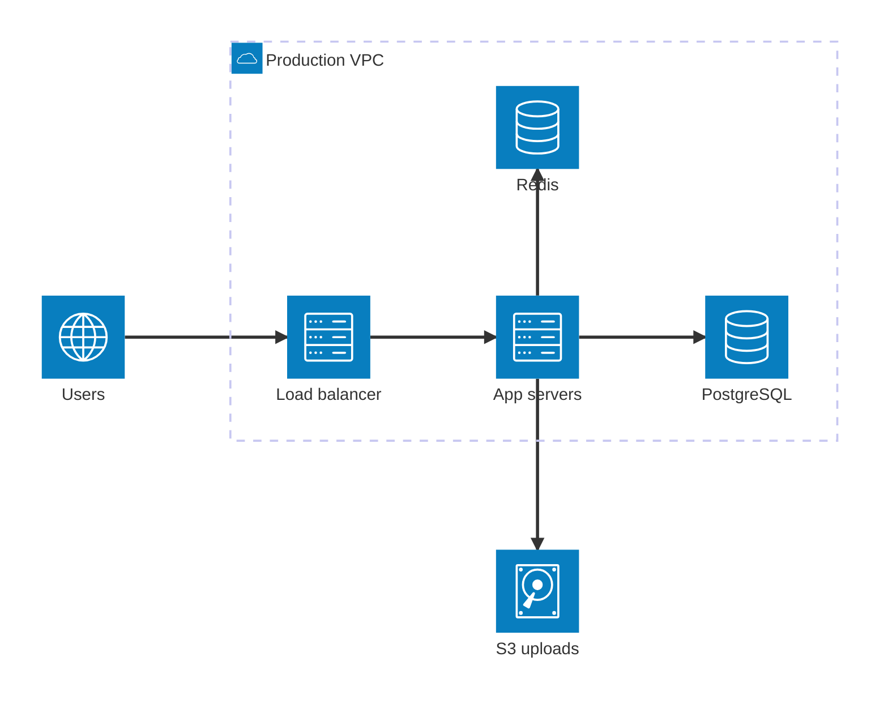
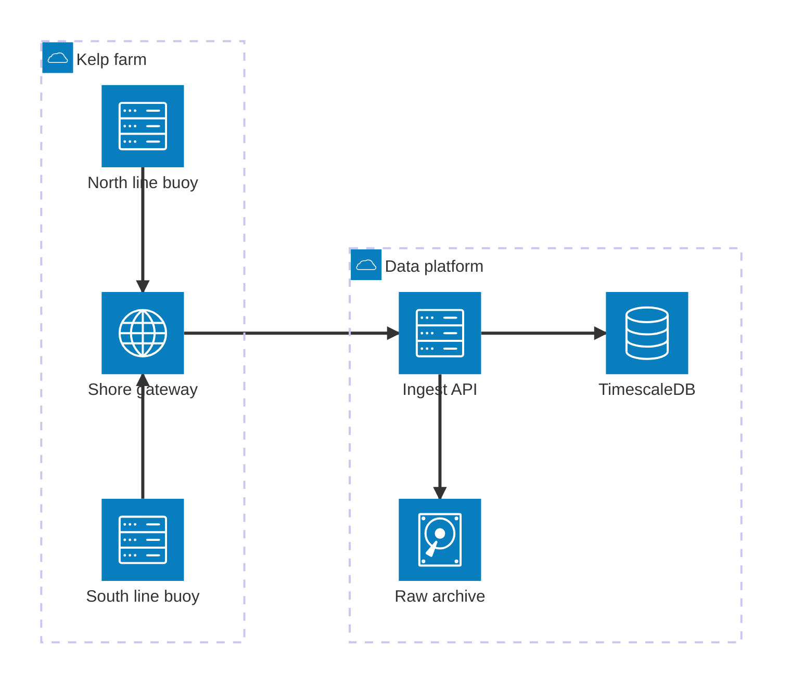

## A web app in the cloud

```mermaid
architecture-beta
    service users(internet)[Users]
    group vpc(cloud)[Production VPC]
    service lb(server)[Load balancer] in vpc
    service app(server)[App servers] in vpc
    service db(database)[PostgreSQL] in vpc
    service cache(database)[Redis] in vpc
    service files(disk)[S3 uploads]

    users:R --> L:lb
    lb:R --> L:app
    app:R --> L:db
    app:T --> B:cache
    app:B --> T:files
```

## A seaweed farm's telemetry

```mermaid
architecture-beta
    group farm(cloud)[Kelp farm]
    service buoy_north(server)[North line buoy] in farm
    service buoy_south(server)[South line buoy] in farm
    service hub(internet)[Shore gateway] in farm

    group platform(cloud)[Data platform]
    service ingest(server)[Ingest API] in platform
    service tsdb(database)[TimescaleDB] in platform
    service archive(disk)[Raw archive] in platform

    buoy_north:B --> T:hub
    buoy_south:T --> B:hub
    hub:R --> L:ingest
    ingest:R --> L:tsdb
    ingest:B --> T:archive
```

## Fanning out through a junction

```mermaid
architecture-beta
    service lb(internet)[Load balancer]
    junction fanout
    service web1(server)[web-1]
    service web2(server)[web-2]
    service web3(server)[web-3]

    lb:R -- L:fanout
    fanout:T --> B:web1
    fanout:R --> L:web2
    fanout:B --> T:web3
```

## Nested groups

```mermaid
architecture-beta
    group region(cloud)[us-west-2]
    group zone_a(cloud)[Zone A] in region
    group zone_b(cloud)[Zone B] in region
    service web_a(server)[Web] in zone_a
    service db_a(database)[Primary] in zone_a
    service web_b(server)[Web] in zone_b
    service db_b(database)[Standby] in zone_b

    web_a:B --> T:db_a
    web_b:B --> T:db_b
    db_a:R --> L:db_b
```
