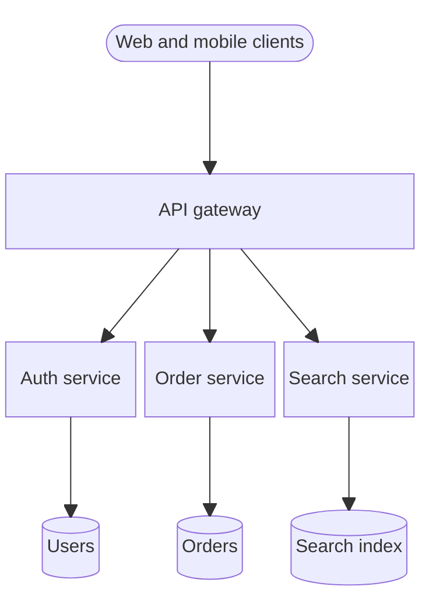
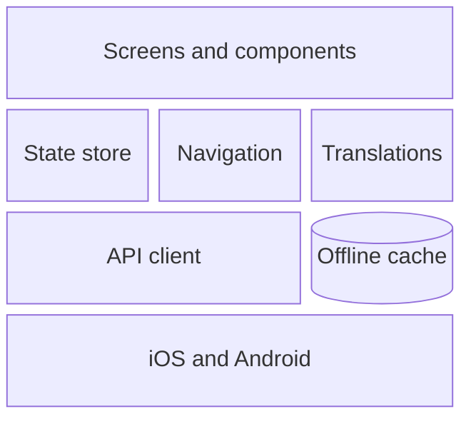
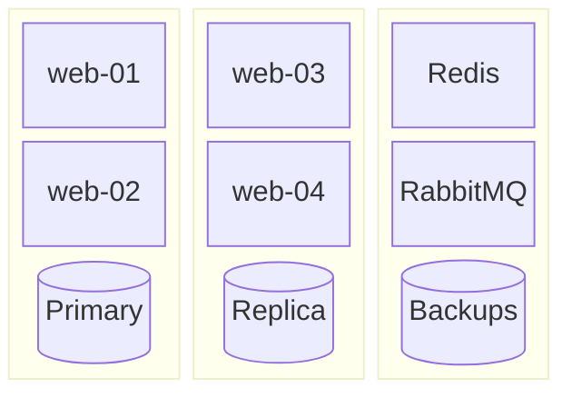
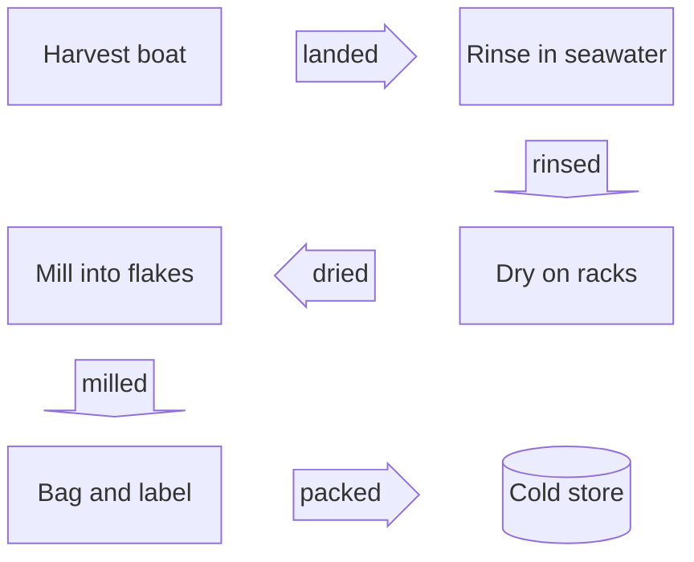
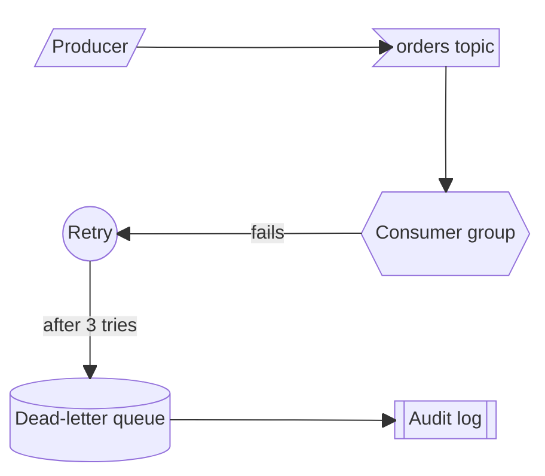

## A web service in three tiers

```mermaid
block
    columns 3
    clients(["Web and mobile clients"]):3
    space:3
    gateway["API gateway"]:3
    space:3
    auth["Auth service"] orders["Order service"] search["Search service"]
    space:3
    users[("Users")] orderdb[("Orders")] index[("Search index")]
    clients --> gateway
    gateway --> auth
    gateway --> orders
    gateway --> search
    auth --> users
    orders --> orderdb
    search --> index
```

## Layers of a mobile app

```mermaid
block
    columns 3
    screens["Screens and components"]:3
    state["State store"] nav["Navigation"] i18n["Translations"]
    api["API client"]:2 cache[("Offline cache")]
    platform["iOS and Android"]:3
```

## Nested blocks in a server room

```mermaid
block
    columns 3
    block:rack1["Rack A"]
        columns 1
        web1["web-01"] web2["web-02"] pg1[("Primary")]
    end
    block:rack2["Rack B"]
        columns 1
        web3["web-03"] web4["web-04"] pg2[("Replica")]
    end
    block:rack3["Rack C"]
        columns 1
        cache1["Redis"] queue1["RabbitMQ"] backup[("Backups")]
    end
```

## Block arrows in a seaweed harvest

```mermaid
block
    columns 3
    boat["Harvest boat"] a1<["landed"]>(right) rinse["Rinse in seawater"]
    space:2 a2<["rinsed"]>(down)
    mill["Mill into flakes"] a3<["dried"]>(left) dry["Dry on racks"]
    a4<["milled"]>(down) space:2
    bag["Bag and label"] a5<["packed"]>(right) store[("Cold store")]
```

## Shapes for a message broker

```mermaid
block
    columns 3
    producer[/"Producer"/] space topic>"orders topic"]
    space:3
    retry(("Retry")) space consumer{{"Consumer group"}}
    space:3
    dlq[("Dead-letter queue")] space audit[["Audit log"]]
    producer --> topic
    topic --> consumer
    consumer -- "fails" --> retry
    retry -- "after 3 tries" --> dlq
    dlq --> audit
```
