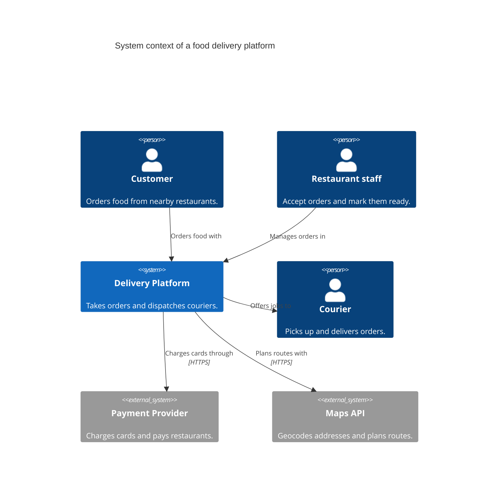
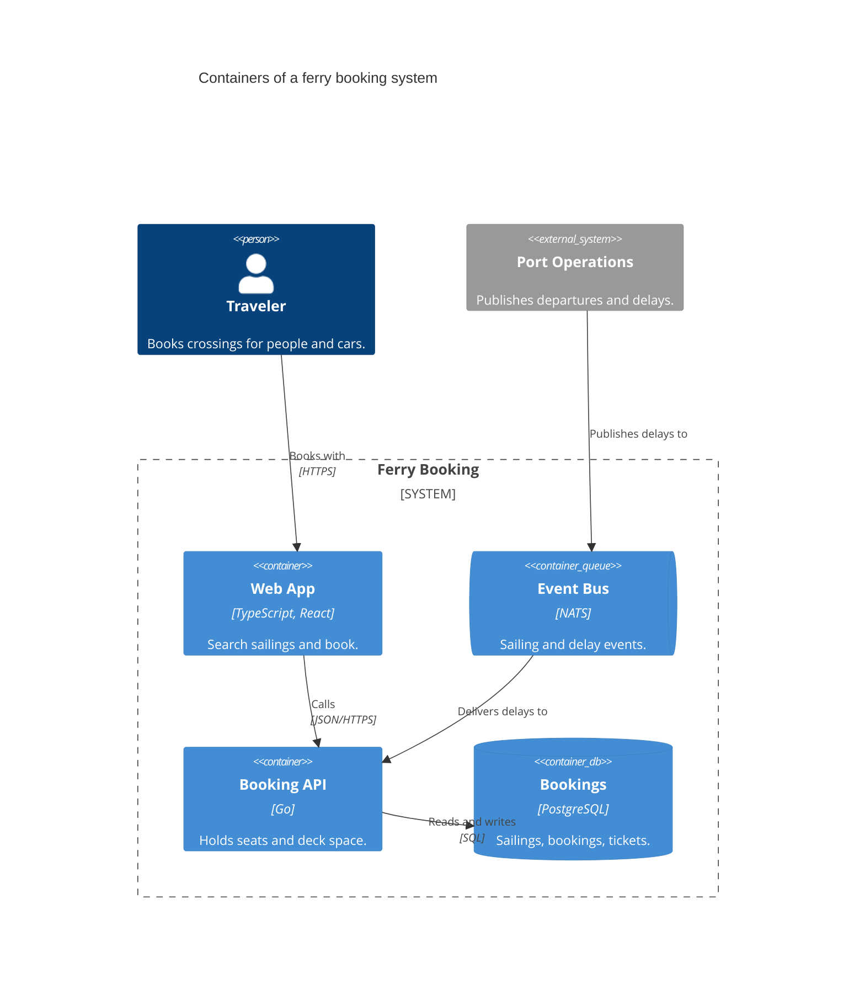
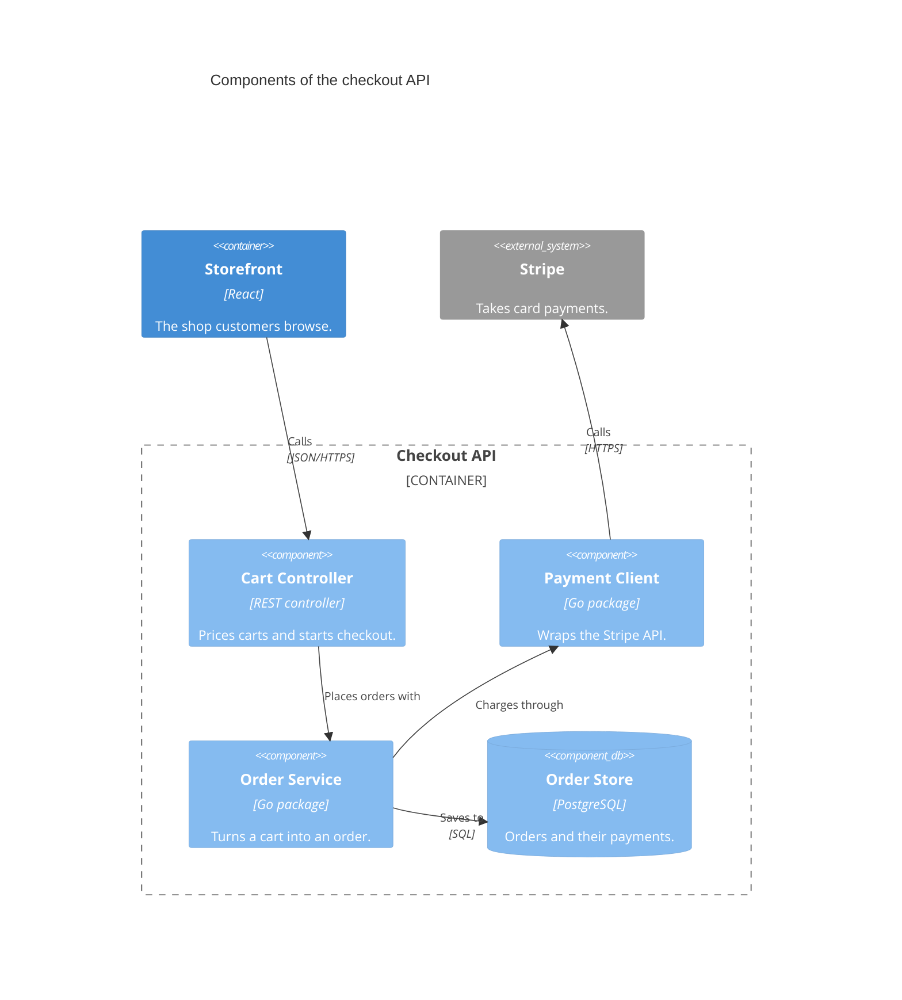
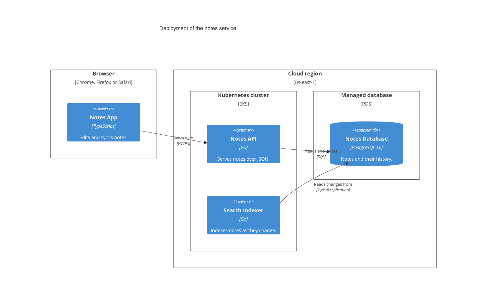

## A food delivery platform

```mermaid
C4Context
    title System context of a food delivery platform
    UpdateLayoutConfig($c4ShapeInRow="2")
    Person(customer, "Customer", "Orders food from nearby restaurants.")
    Person(restaurant, "Restaurant staff", "Accept orders and mark them ready.")
    System(platform, "Delivery Platform", "Takes orders and dispatches couriers.")
    Person(courier, "Courier", "Picks up and delivers orders.")
    System_Ext(payments, "Payment Provider", "Charges cards and pays restaurants.")
    System_Ext(maps, "Maps API", "Geocodes addresses and plans routes.")
    Rel(customer, platform, "Orders food with")
    Rel(restaurant, platform, "Manages orders in")
    Rel(platform, courier, "Offers jobs to")
    Rel(platform, payments, "Charges cards through", "HTTPS")
    Rel(platform, maps, "Plans routes with", "HTTPS")
```

## A ferry booking system's containers

```mermaid
C4Container
    title Containers of a ferry booking system
    UpdateLayoutConfig($c4ShapeInRow="2")
    Person(traveler, "Traveler", "Books crossings for people and cars.")
    System_Ext(port, "Port Operations", "Publishes departures and delays.")
    System_Boundary(booking, "Ferry Booking") {
        Container(web, "Web App", "TypeScript, React", "Search sailings and book.")
        ContainerQueue(events, "Event Bus", "NATS", "Sailing and delay events.")
        Container(api, "Booking API", "Go", "Holds seats and deck space.")
        ContainerDb(db, "Bookings", "PostgreSQL", "Sailings, bookings, tickets.")
    }
    Rel(traveler, web, "Books with", "HTTPS")
    Rel(port, events, "Publishes delays to")
    Rel(web, api, "Calls", "JSON/HTTPS")
    Rel(events, api, "Delivers delays to")
    Rel(api, db, "Reads and writes", "SQL")
```

## The components of a checkout API

```mermaid
C4Component
    title Components of the checkout API
    UpdateLayoutConfig($c4ShapeInRow="2")
    Container(spa, "Storefront", "React", "The shop customers browse.")
    System_Ext(stripe, "Stripe", "Takes card payments.")
    Container_Boundary(api, "Checkout API") {
        Component(cart, "Cart Controller", "REST controller", "Prices carts and starts checkout.")
        Component(pay, "Payment Client", "Go package", "Wraps the Stripe API.")
        Component(orders, "Order Service", "Go package", "Turns a cart into an order.")
        ComponentDb(store, "Order Store", "PostgreSQL", "Orders and their payments.")
    }
    Rel(spa, cart, "Calls", "JSON/HTTPS")
    Rel(cart, orders, "Places orders with")
    Rel(orders, pay, "Charges through")
    Rel(orders, store, "Saves to", "SQL")
    Rel(pay, stripe, "Calls", "HTTPS")
```

## Deploying a web service

```mermaid
C4Deployment
    title Deployment of the notes service
    Deployment_Node(browser, "Browser", "Chrome, Firefox or Safari") {
        Container(spa, "Notes App", "TypeScript", "Edits and syncs notes.")
    }
    Deployment_Node(cloud, "Cloud region", "us-east-1") {
        Deployment_Node(k8s, "Kubernetes cluster", "EKS") {
            Container(api, "Notes API", "Go", "Serves notes over JSON.")
            Container(worker, "Search Indexer", "Go", "Indexes notes as they change.")
        }
        Deployment_Node(rds, "Managed database", "RDS") {
            ContainerDb(db, "Notes Database", "PostgreSQL 16", "Notes and their history.")
        }
    }
    Rel(spa, api, "Syncs with", "HTTPS")
    Rel(api, db, "Reads and writes", "SQL")
    Rel(worker, db, "Reads changes from", "logical replication")
```
