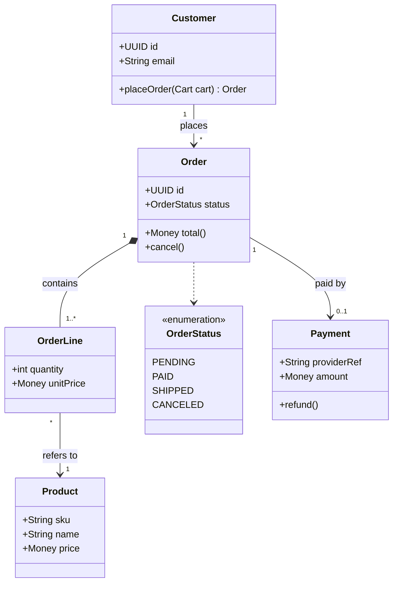
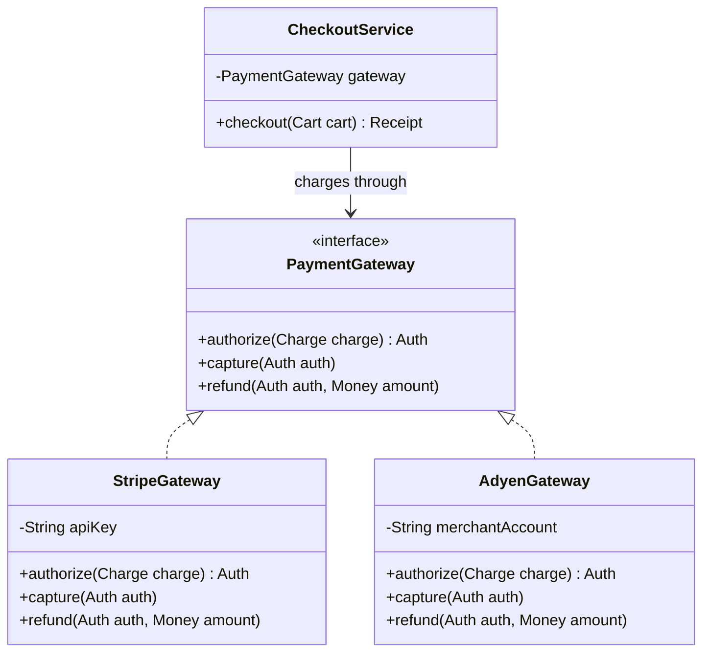
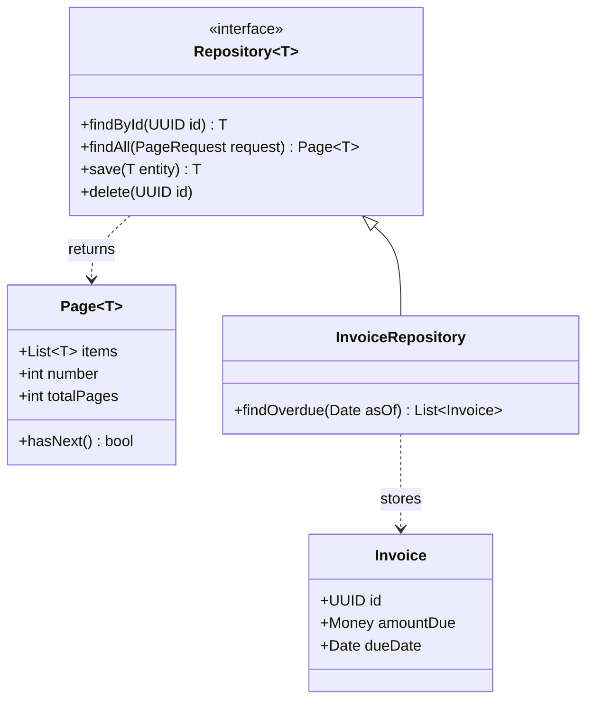
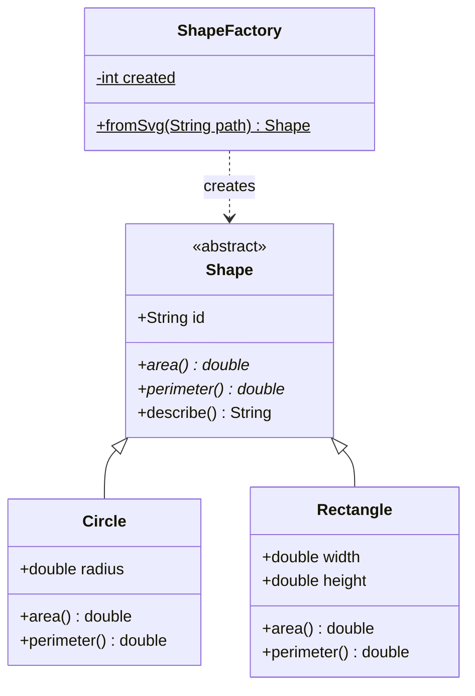
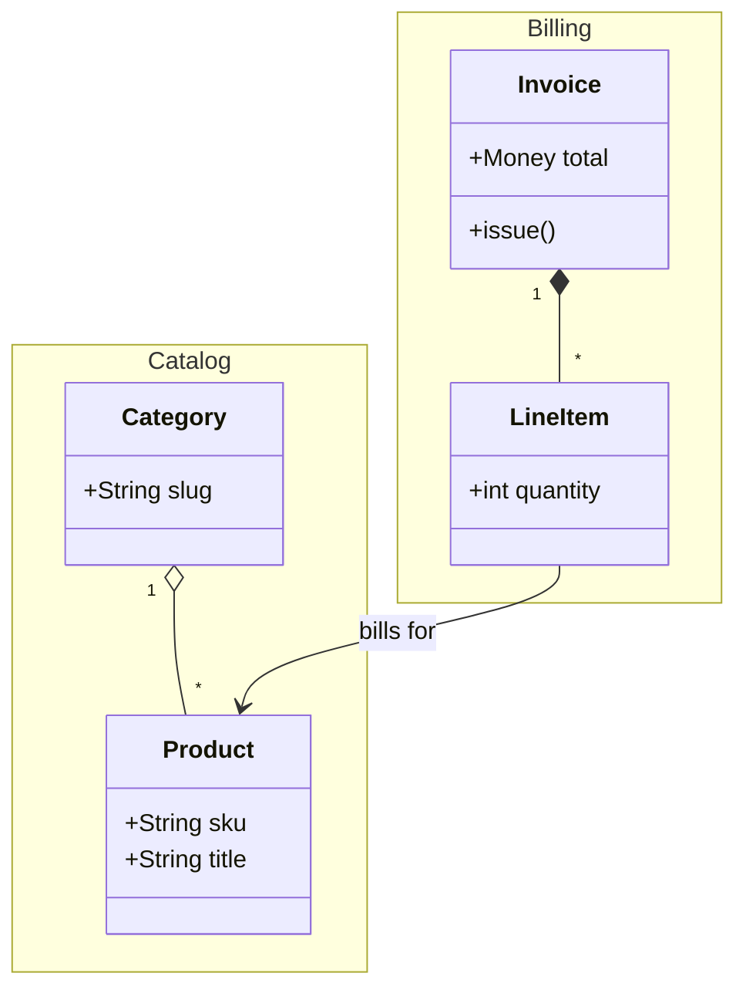
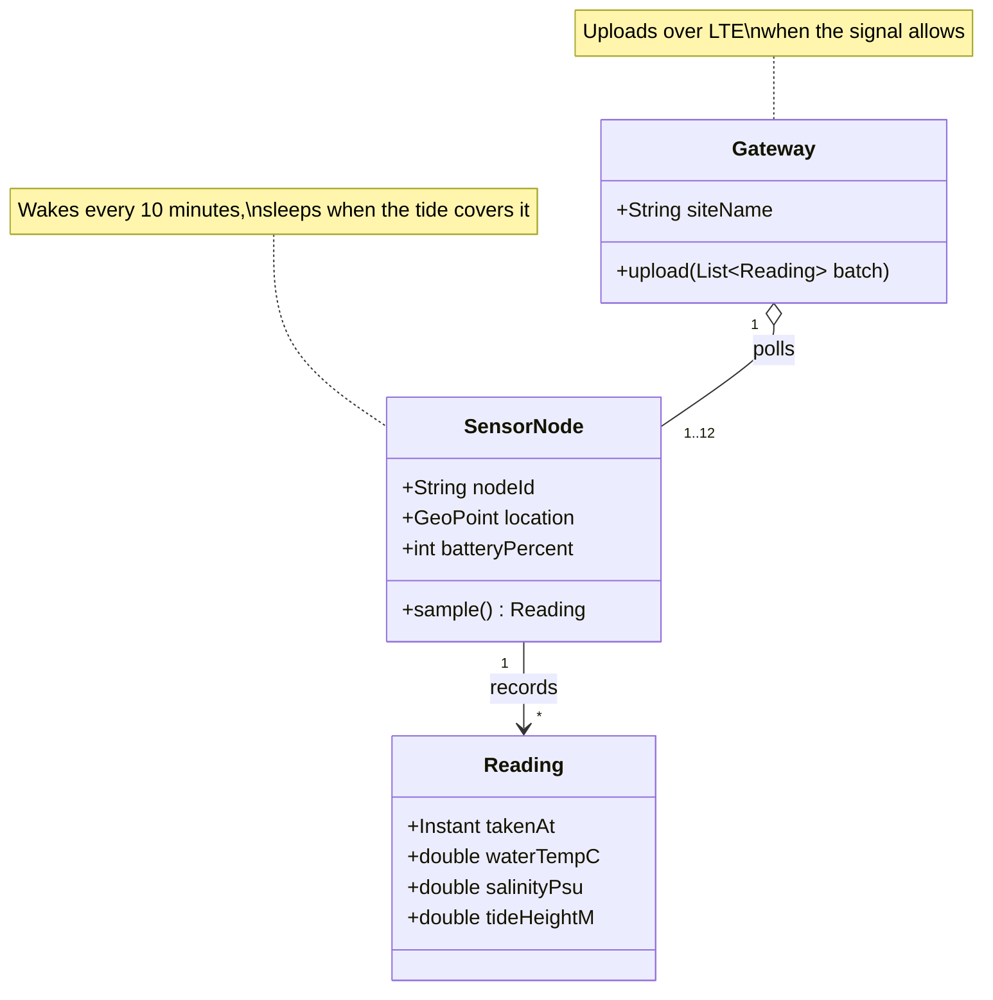

## An online store's orders

```mermaid
classDiagram
    class Customer {
        +UUID id
        +String email
        +placeOrder(Cart cart) Order
    }
    class Order {
        +UUID id
        +OrderStatus status
        +Money total()
        +cancel()
    }
    class OrderLine {
        +int quantity
        +Money unitPrice
    }
    class Product {
        +String sku
        +String name
        +Money price
    }
    class OrderStatus {
        <<enumeration>>
        PENDING
        PAID
        SHIPPED
        CANCELED
    }
    Customer "1" --> "*" Order : places
    Order "1" *-- "1..*" OrderLine : contains
    OrderLine "*" --> "1" Product : refers to
    class Payment {
        +String providerRef
        +Money amount
        +refund()
    }
    Order "1" --> "0..1" Payment : paid by
    Order ..> OrderStatus
```

## Payment gateways

```mermaid
classDiagram
    class PaymentGateway {
        <<interface>>
        +authorize(Charge charge) Auth
        +capture(Auth auth)
        +refund(Auth auth, Money amount)
    }
    class StripeGateway {
        -String apiKey
        +authorize(Charge charge) Auth
        +capture(Auth auth)
        +refund(Auth auth, Money amount)
    }
    class AdyenGateway {
        -String merchantAccount
        +authorize(Charge charge) Auth
        +capture(Auth auth)
        +refund(Auth auth, Money amount)
    }
    class CheckoutService {
        -PaymentGateway gateway
        +checkout(Cart cart) Receipt
    }
    PaymentGateway <|.. StripeGateway
    PaymentGateway <|.. AdyenGateway
    CheckoutService --> PaymentGateway : charges through
```

## A generic repository

```mermaid
classDiagram
    class Repository~T~ {
        <<interface>>
        +findById(UUID id) T
        +findAll(PageRequest request) Page~T~
        +save(T entity) T
        +delete(UUID id)
    }
    class Page~T~ {
        +List~T~ items
        +int number
        +int totalPages
        +hasNext() bool
    }
    class InvoiceRepository {
        +findOverdue(Date asOf) List~Invoice~
    }
    class Invoice {
        +UUID id
        +Money amountDue
        +Date dueDate
    }
    Repository~T~ <|-- InvoiceRepository
    Repository~T~ ..> Page~T~ : returns
    InvoiceRepository ..> Invoice : stores
```

## Abstract classes and static members

```mermaid
classDiagram
    class Shape {
        <<abstract>>
        +String id
        +area()* double
        +perimeter()* double
        +describe() String
    }
    class Circle {
        +double radius
        +area() double
        +perimeter() double
    }
    class Rectangle {
        +double width
        +double height
        +area() double
        +perimeter() double
    }
    class ShapeFactory {
        +fromSvg(String path)$ Shape
        -int created$
    }
    Shape <|-- Circle
    Shape <|-- Rectangle
    ShapeFactory ..> Shape : creates
```

## Packages in namespaces

```mermaid
classDiagram
    namespace Catalog {
        class Product {
            +String sku
            +String title
        }
        class Category {
            +String slug
        }
    }
    namespace Billing {
        class Invoice {
            +Money total
            +issue()
        }
        class LineItem {
            +int quantity
        }
    }
    Category "1" o-- "*" Product
    Invoice "1" *-- "*" LineItem
    LineItem --> Product : bills for
```

## A tide pool sensor network

```mermaid
classDiagram
    class SensorNode {
        +String nodeId
        +GeoPoint location
        +int batteryPercent
        +sample() Reading
    }
    class Reading {
        +Instant takenAt
        +double waterTempC
        +double salinityPsu
        +double tideHeightM
    }
    class Gateway {
        +String siteName
        +upload(List~Reading~ batch)
    }
    SensorNode "1" --> "*" Reading : records
    Gateway "1" o-- "1..12" SensorNode : polls
    note for SensorNode "Wakes every 10 minutes,\nsleeps when the tide covers it"
    note for Gateway "Uploads over LTE\nwhen the signal allows"
```
