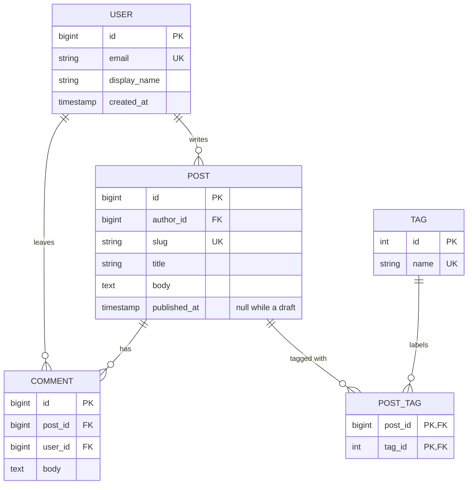
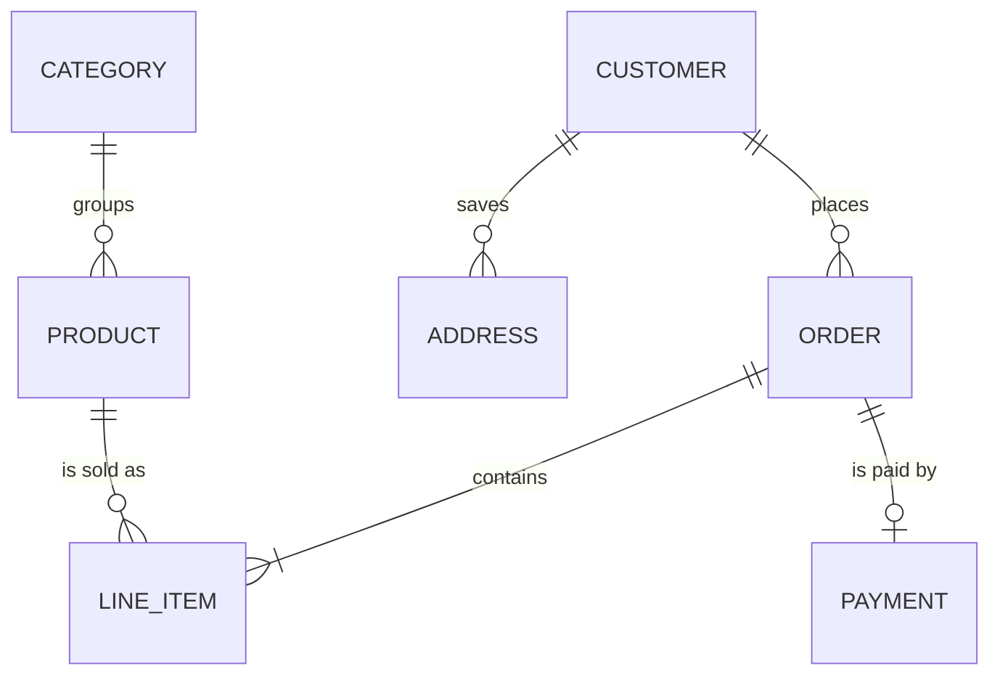
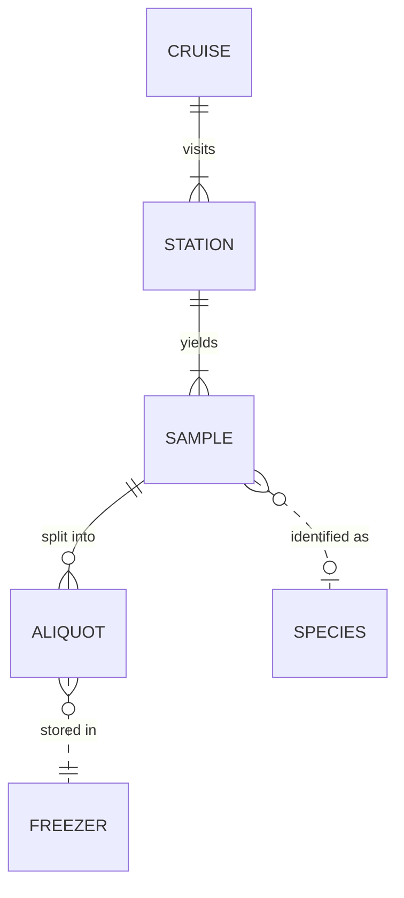
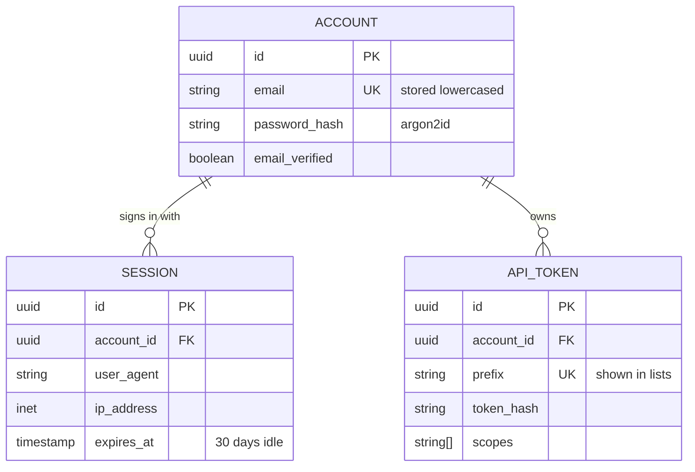
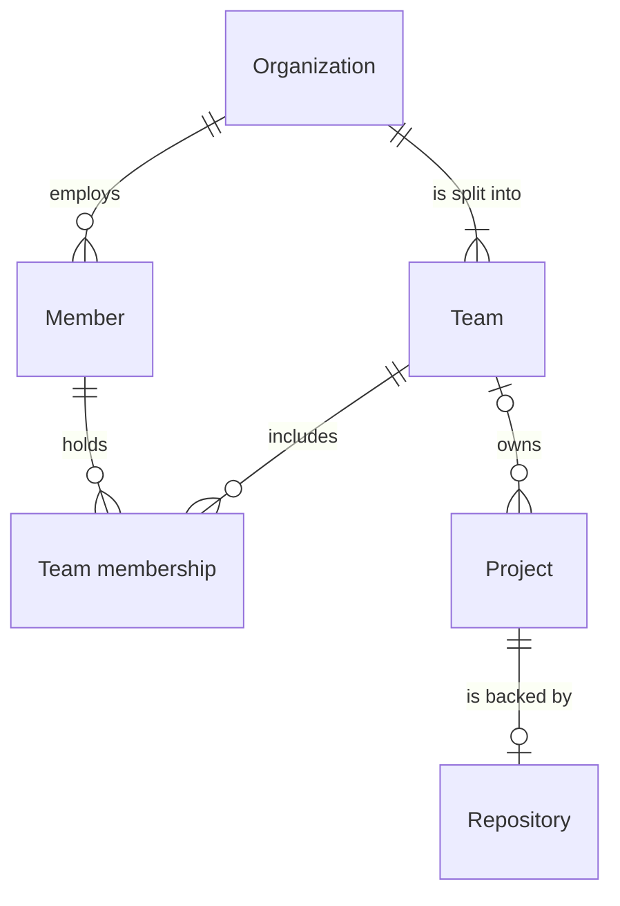
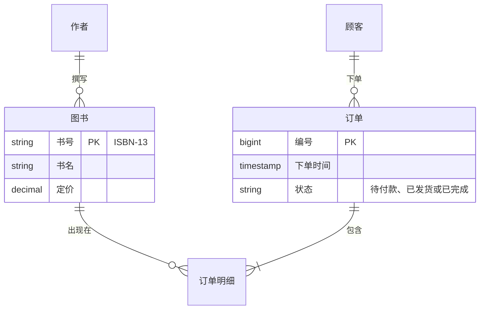

## A blog's schema

```mermaid
erDiagram
    USER ||--o{ POST : writes
    USER ||--o{ COMMENT : leaves
    POST ||--o{ COMMENT : has
    POST ||--o{ POST_TAG : "tagged with"
    TAG ||--o{ POST_TAG : labels
    USER {
        bigint id PK
        string email UK
        string display_name
        timestamp created_at
    }
    POST {
        bigint id PK
        bigint author_id FK
        string slug UK
        string title
        text body
        timestamp published_at "null while a draft"
    }
    COMMENT {
        bigint id PK
        bigint post_id FK
        bigint user_id FK
        text body
    }
    TAG {
        int id PK
        string name UK
    }
    POST_TAG {
        bigint post_id PK, FK
        int tag_id PK, FK
    }
```

## An online store

```mermaid
erDiagram
    CUSTOMER ||--o{ ORDER : places
    CUSTOMER ||--o{ ADDRESS : "saves"
    ORDER ||--|{ LINE_ITEM : contains
    ORDER ||--o| PAYMENT : "is paid by"
    PRODUCT ||--o{ LINE_ITEM : "is sold as"
    CATEGORY ||--o{ PRODUCT : groups
```

## A marine lab's samples

```mermaid
erDiagram
    CRUISE ||--|{ STATION : visits
    STATION ||--|{ SAMPLE : yields
    SAMPLE ||--o{ ALIQUOT : "split into"
    ALIQUOT }o..|| FREEZER : "stored in"
    SAMPLE }o..o| SPECIES : "identified as"
```

## Accounts and sessions

```mermaid
erDiagram
    ACCOUNT {
        uuid id PK
        string email UK "stored lowercased"
        string password_hash "argon2id"
        boolean email_verified
    }
    SESSION {
        uuid id PK
        uuid account_id FK
        string user_agent
        inet ip_address
        timestamp expires_at "30 days idle"
    }
    API_TOKEN {
        uuid id PK
        uuid account_id FK
        string prefix UK "shown in lists"
        string token_hash
        string[] scopes
    }
    ACCOUNT ||--o{ SESSION : "signs in with"
    ACCOUNT ||--o{ API_TOKEN : owns
```

## Workspaces and teams

```mermaid
erDiagram
    ORG["Organization"]
    TEAM["Team"]
    MEMBER["Member"]
    MEMBERSHIP["Team membership"]
    PROJECT["Project"]
    REPO["Repository"]
    ORG ||--|{ TEAM : "is split into"
    ORG ||--o{ MEMBER : employs
    MEMBER ||--o{ MEMBERSHIP : holds
    TEAM ||--o{ MEMBERSHIP : includes
    TEAM |o--o{ PROJECT : owns
    PROJECT ||--o| REPO : "is backed by"
```

## A bookstore's data, in Chinese

```mermaid
erDiagram
    作者 ||--o{ 图书 : 撰写
    图书 ||--o{ 订单明细 : 出现在
    订单 ||--|{ 订单明细 : 包含
    顾客 ||--o{ 订单 : 下单
    图书 {
        string 书号 PK "ISBN-13"
        string 书名
        decimal 定价
    }
    订单 {
        bigint 编号 PK
        timestamp 下单时间
        string 状态 "待付款、已发货或已完成"
    }
```
