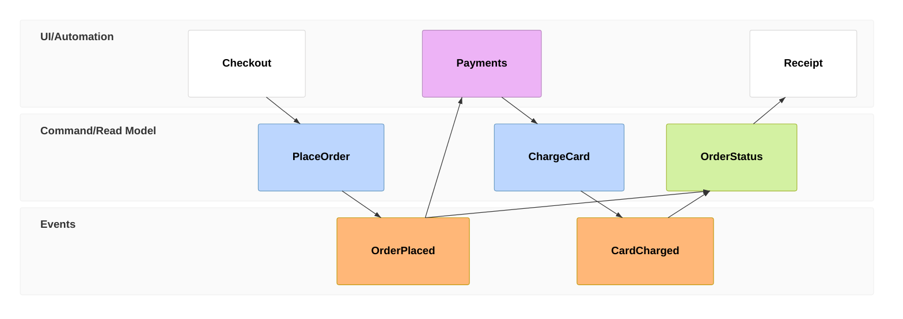
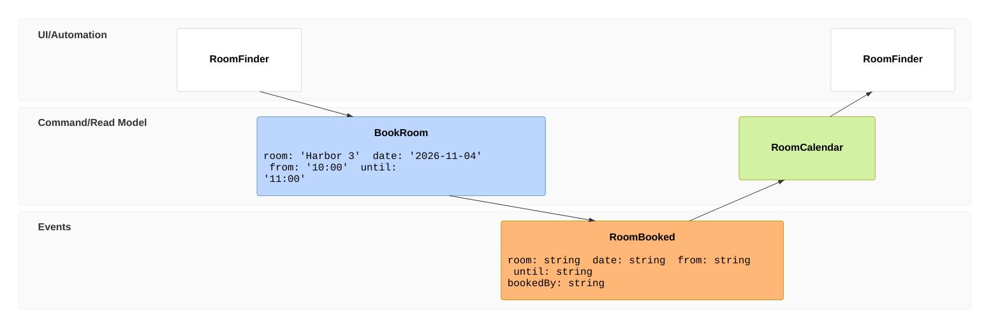
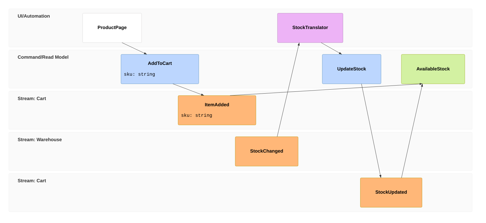
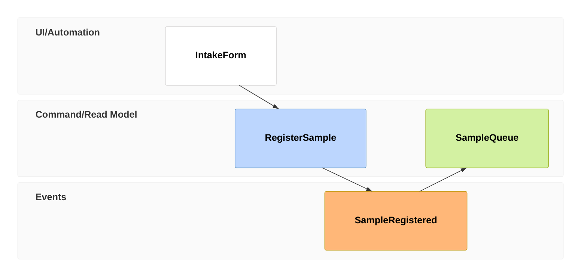

## An online store's checkout

```mermaid
eventmodeling

tf 01 ui Checkout
tf 02 cmd PlaceOrder
tf 03 evt OrderPlaced
tf 04 pcr Payments
tf 05 cmd ChargeCard
tf 06 evt CardCharged
tf 07 rmo OrderStatus ->> 03 ->> 06
tf 08 ui Receipt ->> 07
```

## Booking a meeting room, with its data

```mermaid
eventmodeling

tf 01 ui RoomFinder
tf 02 cmd BookRoom [[BookRoom01]]
tf 03 evt RoomBooked [[RoomBooked]]
tf 04 rmo RoomCalendar ->> 03
tf 05 ui RoomFinder ->> 04

data BookRoom01 {
  room: 'Harbor 3'
  date: '2026-11-04'
  from: '10:00'
  until: '11:00'
}

data RoomBooked {
  room: string
  date: string
  from: string
  until: string
  bookedBy: string
}
```

## Stock levels from another system

```mermaid
eventmodeling

tf 01 ui ProductPage
tf 02 cmd AddToCart { sku: string }
tf 03 evt Cart.ItemAdded { sku: string }

rf 04 evt Warehouse.StockChanged
tf 05 pcr StockTranslator
tf 06 cmd UpdateStock
tf 07 evt Cart.StockUpdated
tf 08 rmo AvailableStock ->> 03 ->> 07
```

## Logging a seawater sample, with a rule and a note

```mermaid
eventmodeling

tf 01 ui IntakeForm
tf 02 cmd RegisterSample
tf 03 evt SampleRegistered
tf 04 rmo SampleQueue ->> 03

note 02 {
  Every bottle carries a station code and a depth.
}

gwt 03
  given evt StationOpened
  when cmd RegisterSample
  then evt SampleRegistered
```
