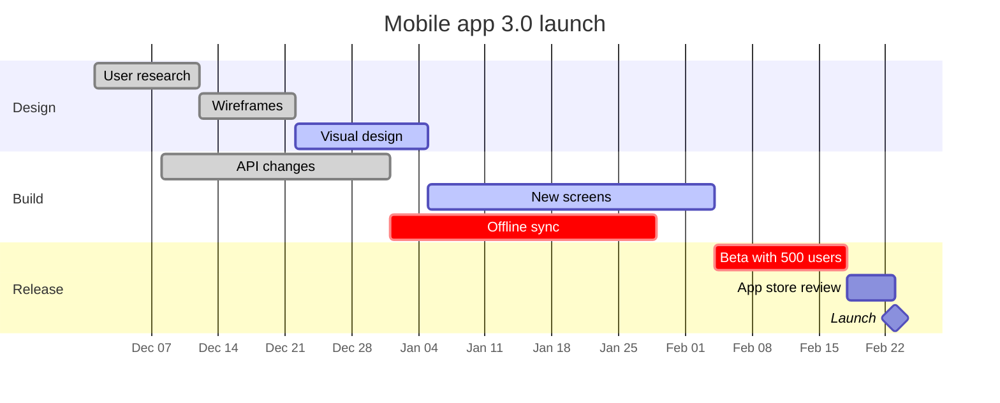
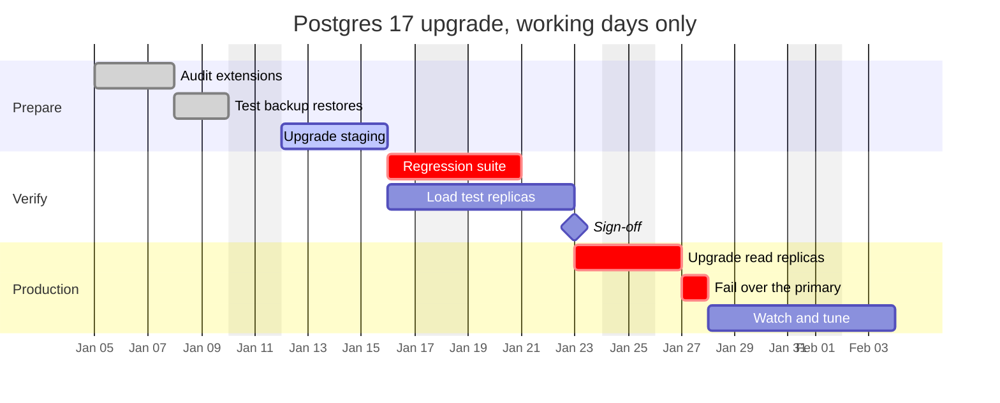
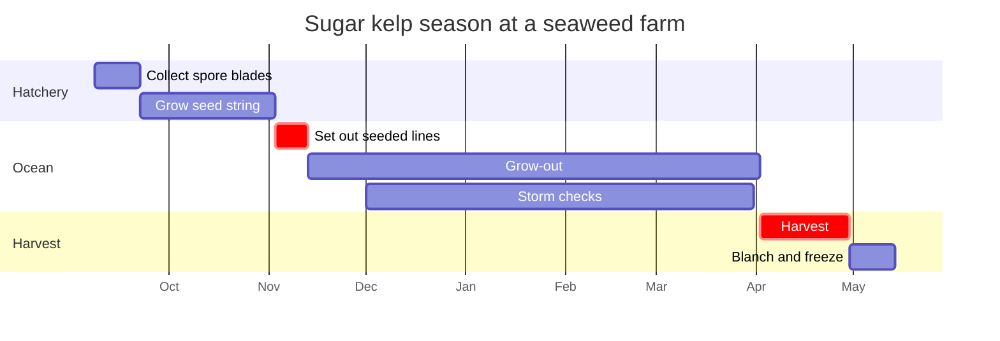
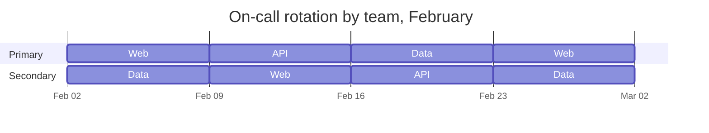

## Mobile app 3.0 launch

```mermaid
gantt
    title Mobile app 3.0 launch
    dateFormat YYYY-MM-DD
    axisFormat %b %d
    section Design
        User research        :done, research, 2025-12-01, 2025-12-12
        Wireframes           :done, wire, after research, 10d
        Visual design        :active, visual, after wire, 14d
    section Build
        API changes          :done, api, 2025-12-08, 24d
        New screens          :active, screens, 2026-01-05, 30d
        Offline sync         :crit, sync, after api, 28d
    section Release
        Beta with 500 users  :crit, beta, after screens sync, 14d
        App store review     :review, after beta, 5d
        Launch               :milestone, after review, 0d
```

## Postgres 17 upgrade

```mermaid
gantt
    title Postgres 17 upgrade, working days only
    dateFormat YYYY-MM-DD
    axisFormat %b %d
    excludes weekends
    section Prepare
        Audit extensions        :done, audit, 2026-01-05, 3d
        Test backup restores    :done, restore, after audit, 2d
        Upgrade staging         :active, staging, after restore, 4d
    section Verify
        Regression suite        :crit, regress, after staging, 3d
        Load test replicas      :load, after staging, 5d
        Sign-off                :milestone, signoff, after regress load, 0d
    section Production
        Upgrade read replicas   :crit, replicas, after signoff, 2d
        Fail over the primary   :crit, failover, after replicas, 1d
        Watch and tune          :after failover, 5d
```

## Release night cutover

```mermaid
gantt
    title Release night cutover
    dateFormat HH:mm
    axisFormat %H:%M
    Maintenance window opens :vert, 22:00, 1m
    section Database
        Snapshot the primary  :done, snap, 22:00, 20m
        Run migrations        :crit, migrate, after snap, 35m
    section Services
        Drain traffic         :done, drain, 22:00, 10m
        Deploy version 8.2    :crit, deploy, after migrate, 25m
        Smoke tests           :smoke, after deploy, 15m
    section Traffic
        Send 10% of traffic   :canary, after smoke, 20m
        Send all traffic      :after canary, 10m
        All clear             :milestone, after canary, 0m
```

## Sugar kelp season

```mermaid
gantt
    title Sugar kelp season at a seaweed farm
    dateFormat MM/DD/YYYY
    axisFormat %b
    tickInterval 1month
    section Hatchery
        Collect spore blades     :spores, 09/08/2025, 2w
        Grow seed string         :seed, after spores, 6w
    section Ocean
        Set out seeded lines     :crit, lines, after seed, 10d
        Grow-out                 :grow, after lines, 20w
        Storm checks             :12/01/2025, 03/31/2026
    section Harvest
        Harvest                  :crit, harvest, after grow, 4w
        Blanch and freeze        :after harvest, 2w
```

## On-call rotation

```mermaid
---
displayMode: compact
---
gantt
    title On-call rotation by team, February
    dateFormat YYYY-MM-DD
    axisFormat %b %d
    tickInterval 1week
    weekday monday
    section Primary
        Web            :2026-02-02, 7d
        API            :7d
        Data           :7d
        Web            :7d
    section Secondary
        Data           :2026-02-02, 7d
        Web            :7d
        API            :7d
        Data           :7d
```
