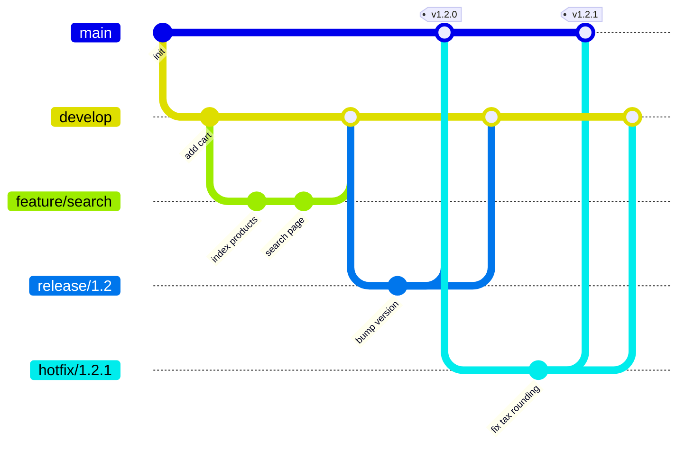
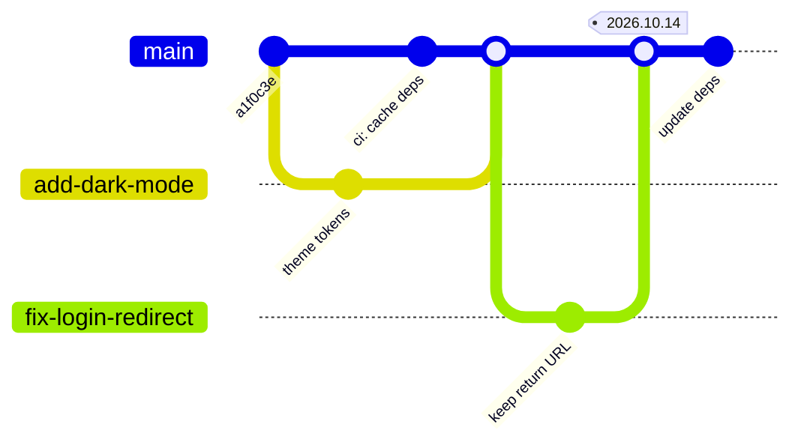
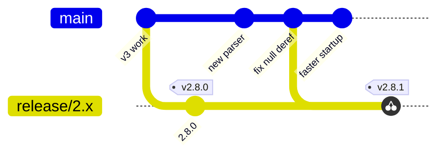
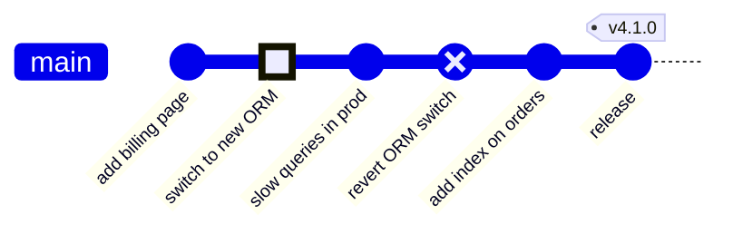
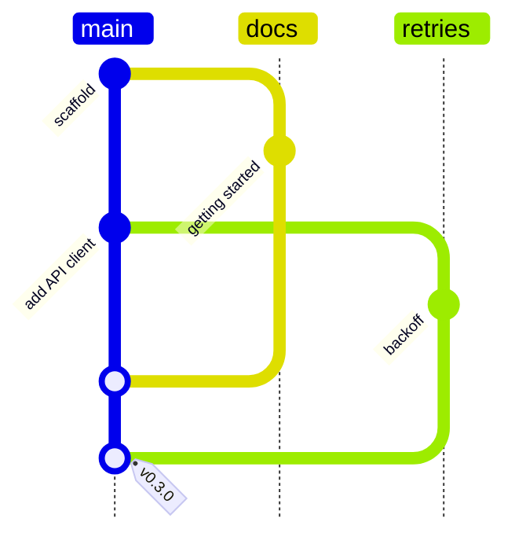
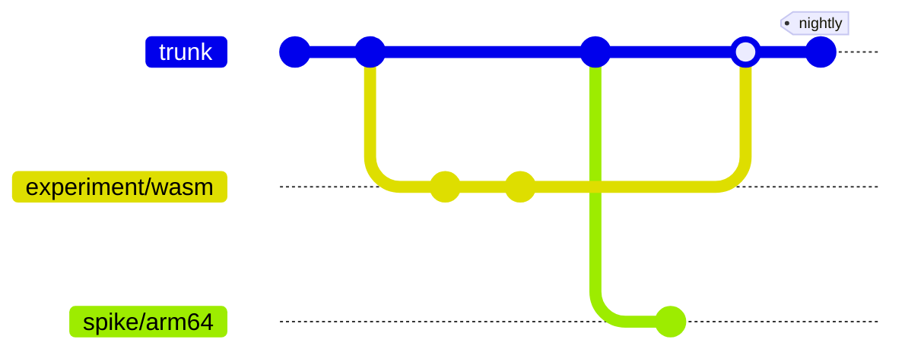

## A release with Git flow

```mermaid
gitGraph
    commit id: "init"
    branch develop
    checkout develop
    commit id: "add cart"
    branch feature/search
    checkout feature/search
    commit id: "index products"
    commit id: "search page"
    checkout develop
    merge feature/search
    branch release/1.2
    checkout release/1.2
    commit id: "bump version"
    checkout main
    merge release/1.2 tag: "v1.2.0"
    checkout develop
    merge release/1.2
    checkout main
    branch hotfix/1.2.1
    checkout hotfix/1.2.1
    commit id: "fix tax rounding"
    checkout main
    merge hotfix/1.2.1 tag: "v1.2.1"
    checkout develop
    merge hotfix/1.2.1
```

## Trunk-based development

```mermaid
gitGraph
    commit id: "a1f0c3e"
    branch add-dark-mode
    checkout add-dark-mode
    commit id: "theme tokens"
    checkout main
    commit id: "ci: cache deps"
    merge add-dark-mode
    branch fix-login-redirect
    checkout fix-login-redirect
    commit id: "keep return URL"
    checkout main
    merge fix-login-redirect tag: "2026.10.14"
    commit id: "update deps"
```

## Backporting a fix

```mermaid
gitGraph
    commit id: "v3 work"
    branch release/2.x
    checkout release/2.x
    commit id: "2.8.0" tag: "v2.8.0"
    checkout main
    commit id: "new parser"
    commit id: "fix null deref"
    commit id: "faster startup"
    checkout release/2.x
    cherry-pick id: "fix null deref" tag: "v2.8.1"
```

## Reverts and highlights

```mermaid
gitGraph
    commit id: "add billing page"
    commit id: "switch to new ORM" type: HIGHLIGHT
    commit id: "slow queries in prod"
    commit id: "revert ORM switch" type: REVERSE
    commit id: "add index on orders"
    commit id: "release" tag: "v4.1.0"
```

## Top to bottom

```mermaid
gitGraph TB:
    commit id: "scaffold"
    branch docs
    checkout docs
    commit id: "getting started"
    checkout main
    commit id: "add API client"
    branch retries
    checkout retries
    commit id: "backoff"
    checkout main
    merge docs
    merge retries tag: "v0.3.0"
```

## A renamed main branch

```mermaid
---
config:
  gitGraph:
    mainBranchName: trunk
    showCommitLabel: false
---
gitGraph
    commit
    commit
    branch experiment/wasm
    checkout experiment/wasm
    commit
    commit
    checkout trunk
    commit
    branch spike/arm64
    checkout spike/arm64
    commit
    checkout trunk
    merge experiment/wasm
    commit tag: "nightly"
```
