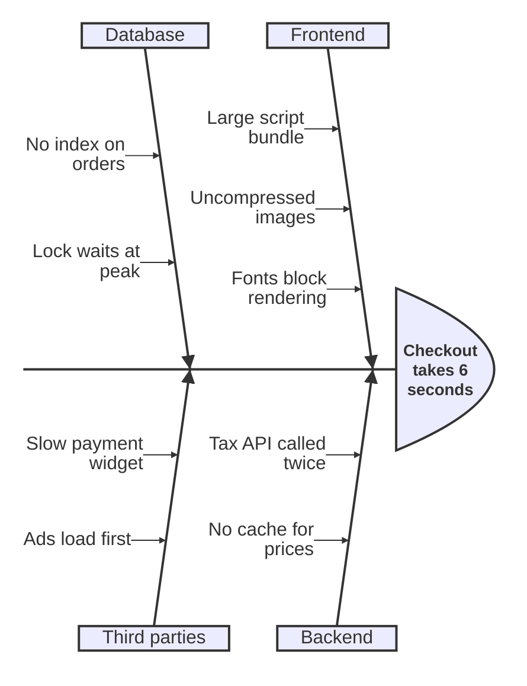
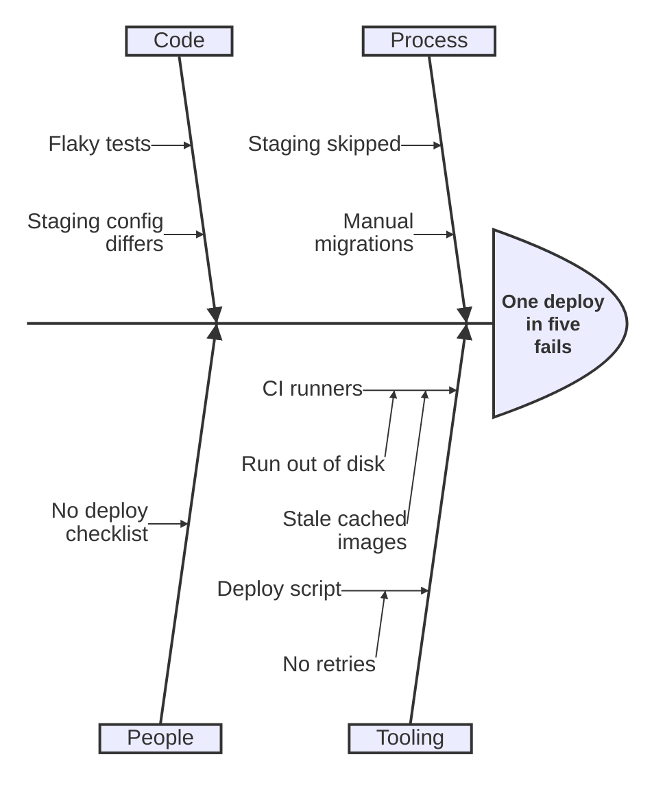
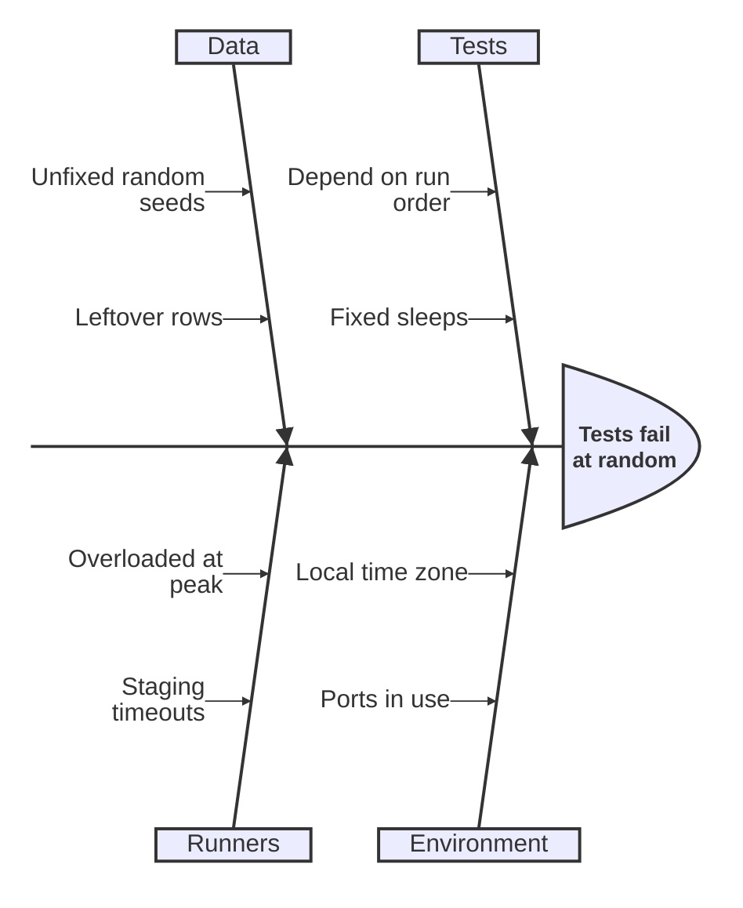

## Slow checkout page

```mermaid
ishikawa-beta
    Checkout takes 6 seconds
    Frontend
        Large script bundle
        Uncompressed images
        Fonts block rendering
    Backend
        Tax API called twice
        No cache for prices
    Database
        No index on orders
        Lock waits at peak
    Third parties
        Slow payment widget
        Ads load first
```

## Failed deploys

```mermaid
ishikawa-beta
    One deploy in five fails
    Process
        Staging skipped
        Manual migrations
    Tooling
        CI runners
            Run out of disk
            Stale cached images
        Deploy script
            No retries
    Code
        Flaky tests
        Staging config differs
    People
        No deploy checklist
```

## Flaky test suite

```mermaid
ishikawa-beta
    Tests fail at random
    Tests
        Depend on run order
        Fixed sleeps
    Environment
        Local time zone
        Ports in use
    Data
        Unfixed random seeds
        Leftover rows
    Runners
        Overloaded at peak
        Staging timeouts
```
