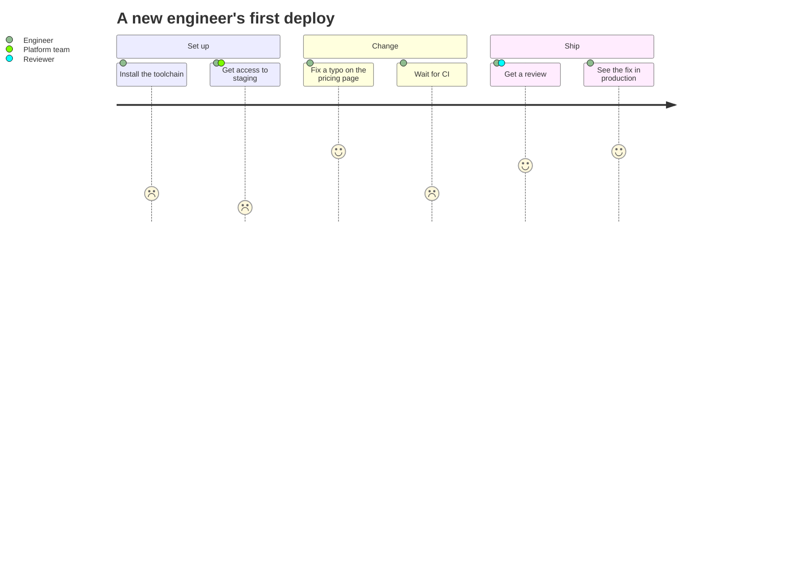
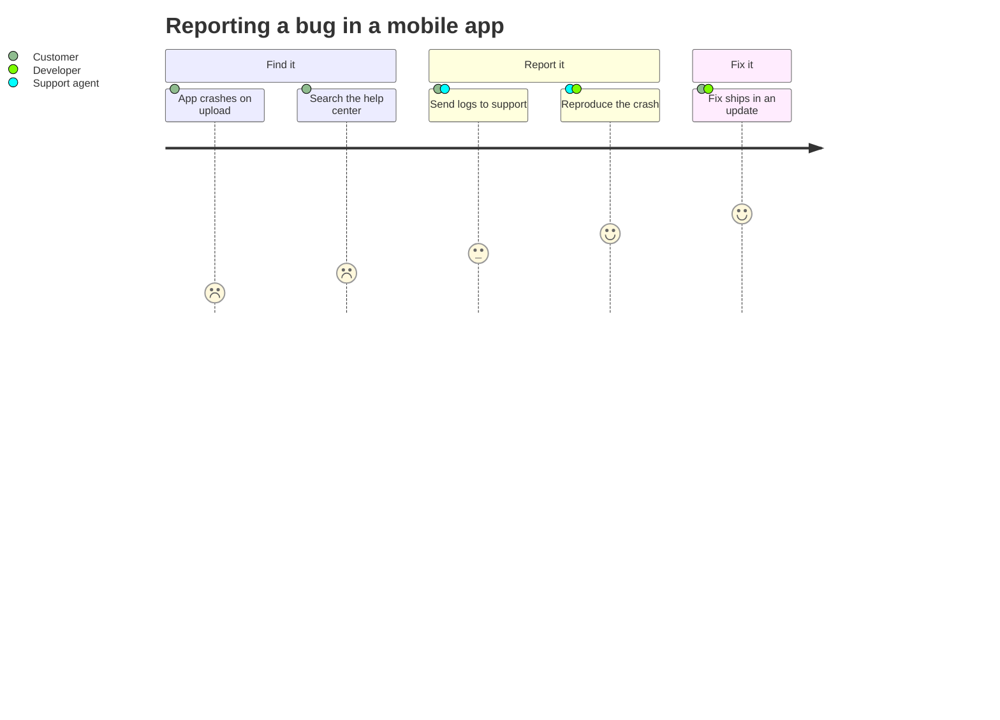
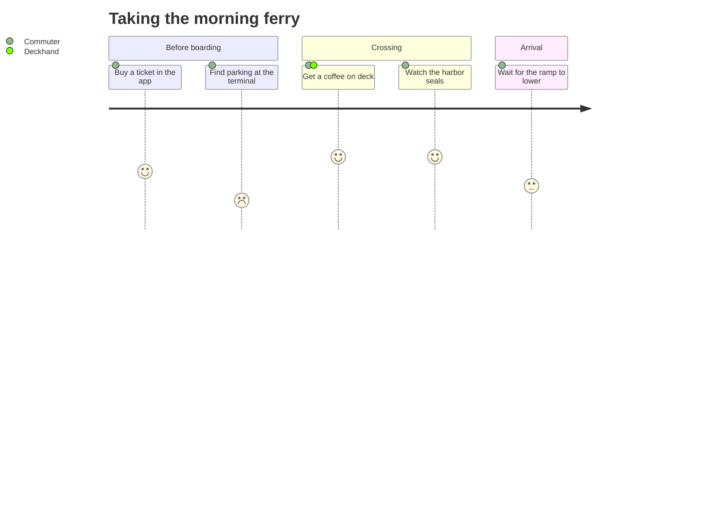

## Shipping a first deploy

```mermaid
journey
    title A new engineer's first deploy
    section Set up
        Install the toolchain: 2: Engineer
        Get access to staging: 1: Engineer, Platform team
    section Change
        Fix a typo on the pricing page: 5: Engineer
        Wait for CI: 2: Engineer
    section Ship
        Get a review: 4: Engineer, Reviewer
        See the fix in production: 5: Engineer
```

## Several actors in a bug report

```mermaid
journey
    title Reporting a bug in a mobile app
    section Find it
        App crashes on upload: 1: Customer
        Search the help center: 2: Customer
    section Report it
        Send logs to support: 3: Customer, Support agent
        Reproduce the crash: 4: Support agent, Developer
    section Fix it
        Fix ships in an update: 5: Customer, Developer
```

## Taking the morning ferry

```mermaid
journey
    title Taking the morning ferry
    section Before boarding
        Buy a ticket in the app: 4: Commuter
        Find parking at the terminal: 2: Commuter
    section Crossing
        Get a coffee on deck: 5: Commuter, Deckhand
        Watch the harbor seals: 5: Commuter
    section Arrival
        Wait for the ramp to lower: 3: Commuter
```
