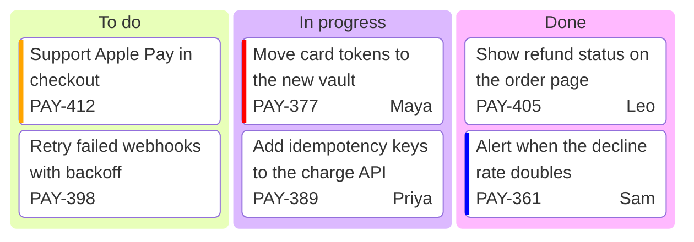
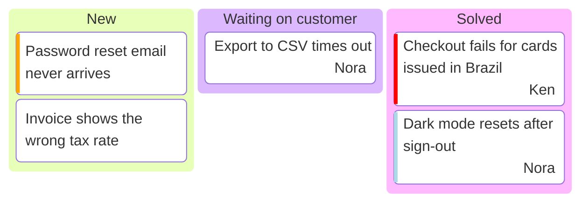
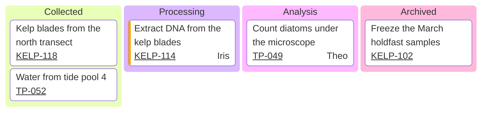

## Sprint board for a payments team

```mermaid
kanban
    todo[To do]
        pay1[Support Apple Pay in checkout]@{ ticket: PAY-412, priority: 'High' }
        pay2[Retry failed webhooks with backoff]@{ ticket: PAY-398 }
    doing[In progress]
        pay3[Move card tokens to the new vault]@{ ticket: PAY-377, assigned: 'Maya', priority: 'Very High' }
        pay4[Add idempotency keys to the charge API]@{ ticket: PAY-389, assigned: 'Priya' }
    done[Done]
        pay5[Show refund status on the order page]@{ ticket: PAY-405, assigned: 'Leo' }
        pay6[Alert when the decline rate doubles]@{ ticket: PAY-361, assigned: 'Sam', priority: 'Low' }
```

## Support queue on a Monday

```mermaid
kanban
    new[New]
        t1[Password reset email never arrives]@{ priority: 'High' }
        t2[Invoice shows the wrong tax rate]
    waiting[Waiting on customer]
        t3[Export to CSV times out]@{ assigned: 'Nora' }
    solved[Solved]
        t4[Checkout fails for cards issued in Brazil]@{ assigned: 'Ken', priority: 'Very High' }
        t5[Dark mode resets after sign-out]@{ assigned: 'Nora', priority: 'Very Low' }
```

## Ticket links in a marine lab

```mermaid
---
config:
  kanban:
    ticketBaseUrl: 'https://lims.example.org/samples/#TICKET#'
---
kanban
    collected[Collected]
        s1[Kelp blades from the north transect]@{ ticket: KELP-118 }
        s2[Water from tide pool 4]@{ ticket: TP-052 }
    processing[Processing]
        s3[Extract DNA from the kelp blades]@{ ticket: KELP-114, assigned: 'Iris', priority: 'High' }
    analysis[Analysis]
        s4[Count diatoms under the microscope]@{ ticket: TP-049, assigned: 'Theo' }
    archived[Archived]
        s5[Freeze the March holdfast samples]@{ ticket: KELP-102 }
```
