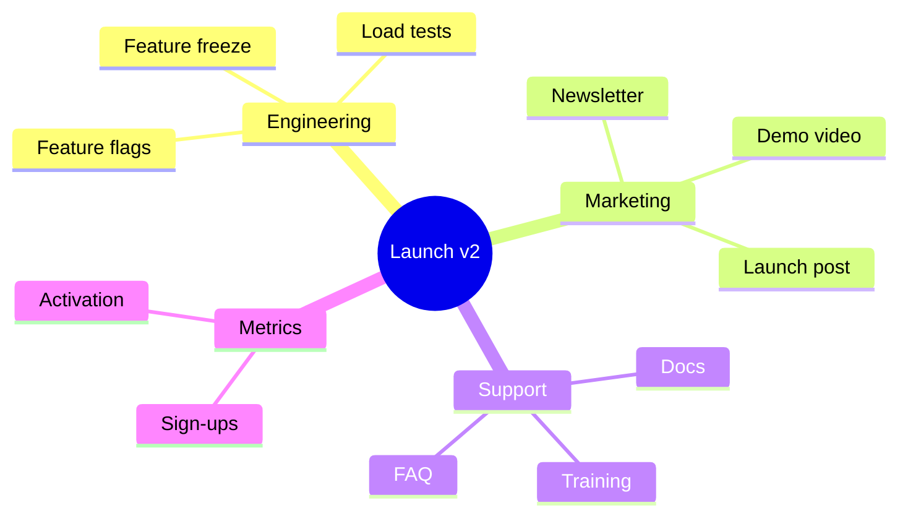
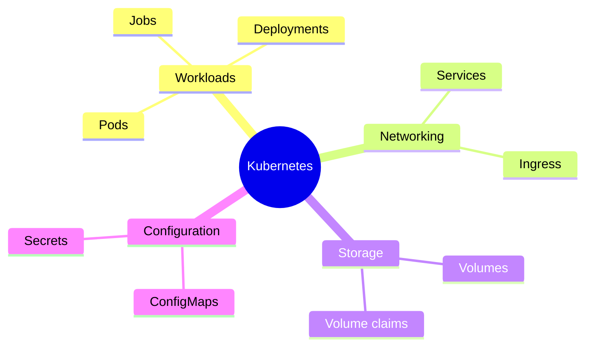
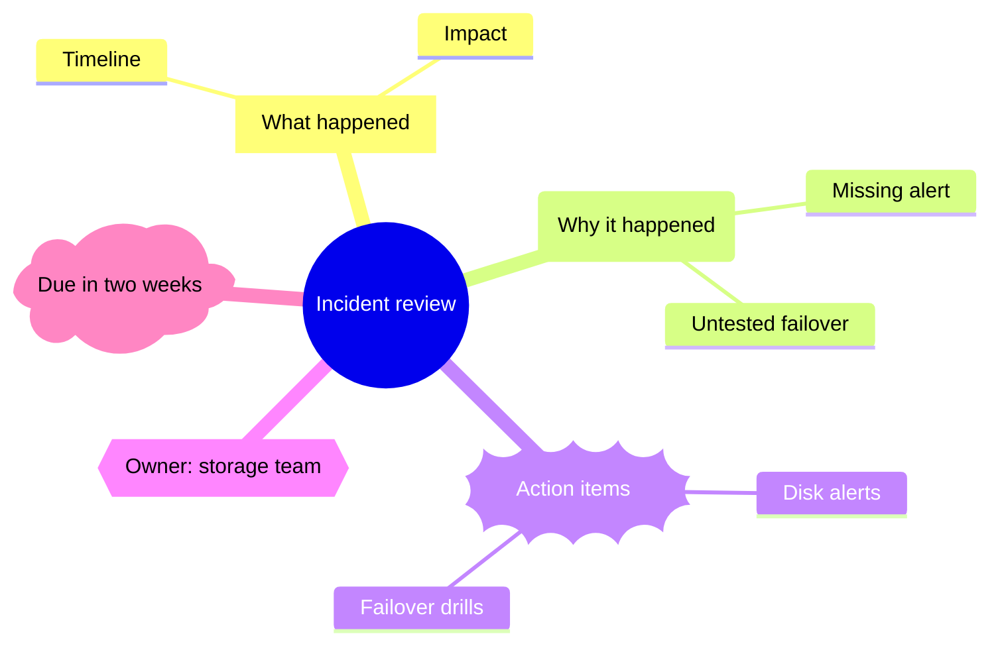
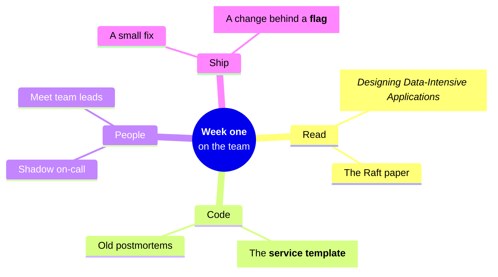
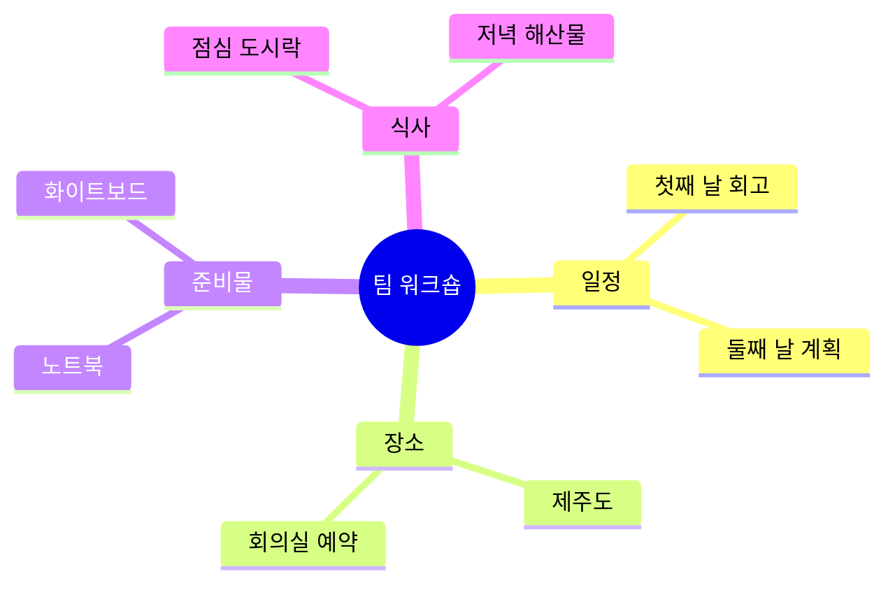

## Planning a product launch

```mermaid
mindmap
    root((Launch v2))
        Engineering
            Feature freeze
            Load tests
            Feature flags
        Marketing
            Launch post
            Demo video
            Newsletter
        Support
            Docs
            Training
            FAQ
        Metrics
            Sign-ups
            Activation
```

## Learning Kubernetes

```mermaid
mindmap
    root((Kubernetes))
        Workloads
            Pods
            Deployments
            Jobs
        Networking
            Services
            Ingress
        Storage
            Volumes
            Volume claims
        Configuration
            ConfigMaps
            Secrets
```

## An incident review

```mermaid
mindmap
    root((Incident review))
        [What happened]
            Timeline
            Impact
        (Why it happened)
            Missing alert
            Untested failover
        ))Action items((
            Disk alerts
            Failover drills
        {{Owner: storage team}}
        )Due in two weeks(
```

## A new engineer's first week

```mermaid
mindmap
    root(("`**Week one**
    on the team`"))
        Read
            ["`*Designing Data-Intensive Applications*`"]
            The Raft paper
        Code
            ["`The **service template**`"]
            Old postmortems
        People
            Shadow on-call
            Meet team leads
        Ship
            A small fix
            ["`A change behind a **flag**`"]
```

## Planning a team offsite, in Korean

```mermaid
mindmap
  root((팀 워크숍))
    일정
      첫째 날 회고
      둘째 날 계획
    장소
      제주도
      회의실 예약
    준비물
      노트북
      화이트보드
    식사
      점심 도시락
      저녁 해산물
```
