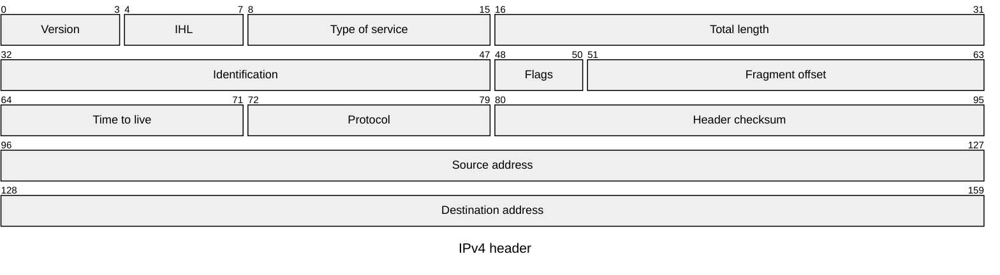
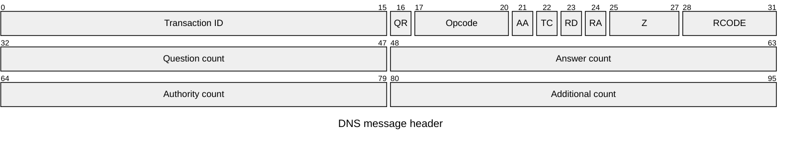
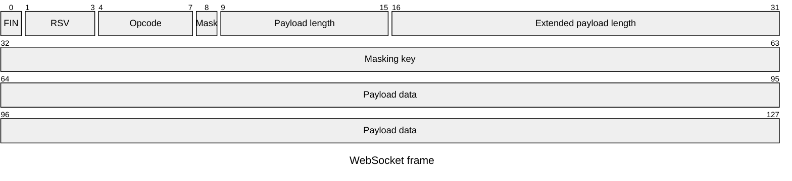
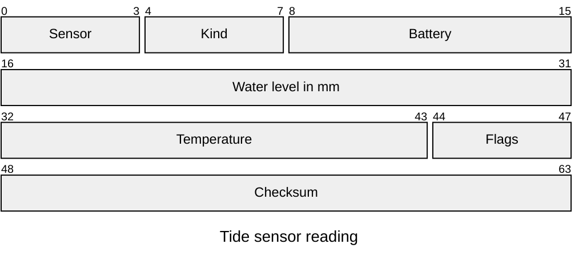

## IPv4 header

```mermaid
packet
title IPv4 header
0-3: "Version"
4-7: "IHL"
8-15: "Type of service"
16-31: "Total length"
32-47: "Identification"
48-50: "Flags"
51-63: "Fragment offset"
64-71: "Time to live"
72-79: "Protocol"
80-95: "Header checksum"
96-127: "Source address"
128-159: "Destination address"
```

## Field lengths in a DNS message header

```mermaid
packet
title DNS message header
+16: "Transaction ID"
+1: "QR"
+4: "Opcode"
+1: "AA"
+1: "TC"
+1: "RD"
+1: "RA"
+3: "Z"
+4: "RCODE"
+16: "Question count"
+16: "Answer count"
+16: "Authority count"
+16: "Additional count"
```

## Single bits in a WebSocket frame

```mermaid
packet
title WebSocket frame
0: "FIN"
1-3: "RSV"
4-7: "Opcode"
8: "Mask"
9-15: "Payload length"
16-31: "Extended payload length"
32-63: "Masking key"
64-127: "Payload data"
```

## Bits per row in a tide sensor reading

```mermaid
---
config:
  packet:
    bitsPerRow: 16
---
packet
title Tide sensor reading
+4: "Sensor"
+4: "Kind"
+8: "Battery"
+16: "Water level in mm"
+12: "Temperature"
+4: "Flags"
+16: "Checksum"
```
