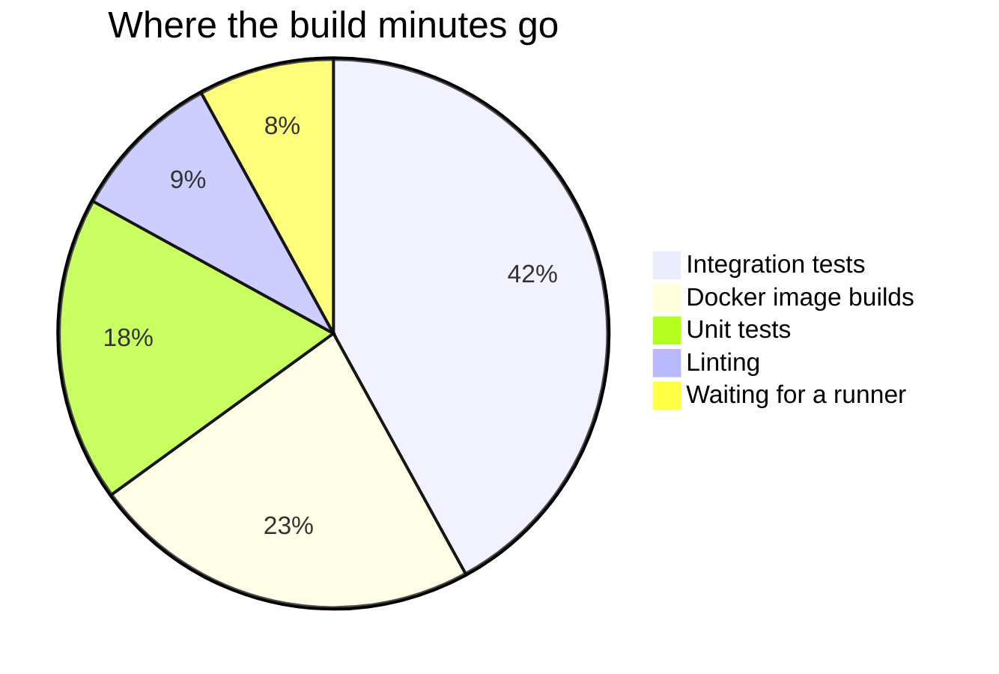
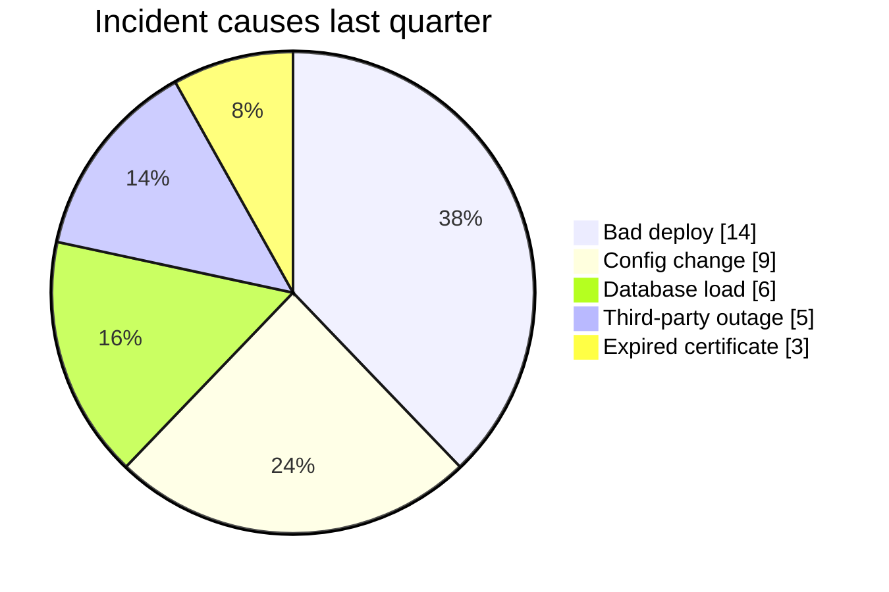
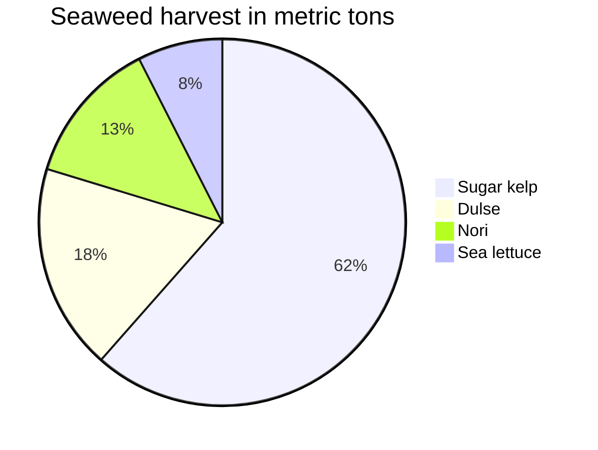

## Where the build minutes go

```mermaid
pie title Where the build minutes go
    "Integration tests" : 42
    "Docker image builds" : 23
    "Unit tests" : 18
    "Linting" : 9
    "Waiting for a runner" : 8
```

## Values shown with incident causes

```mermaid
pie showData
    title Incident causes last quarter
    "Bad deploy" : 14
    "Config change" : 9
    "Database load" : 6
    "Third-party outage" : 5
    "Expired certificate" : 3
```

## A donut of a seaweed harvest

```mermaid
---
config:
  pie:
    donutHole: 0.5
---
pie title Seaweed harvest in metric tons
    "Sugar kelp" : 61.5
    "Dulse" : 18.2
    "Nori" : 12.8
    "Sea lettuce" : 7.5
```
