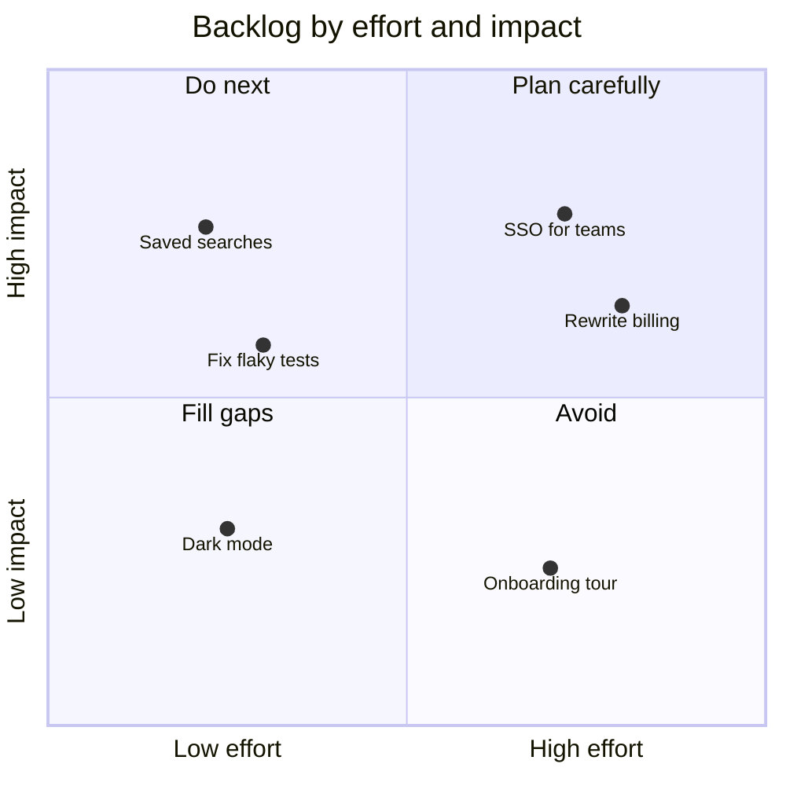
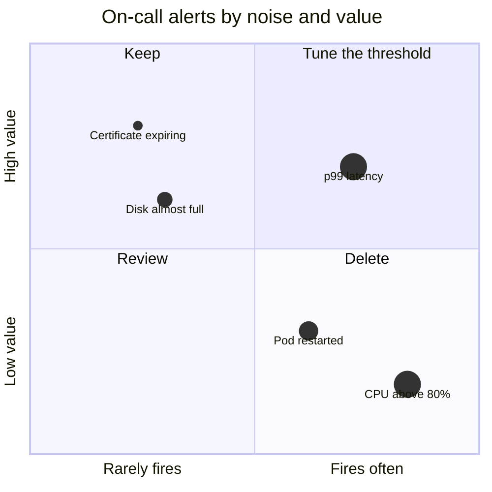
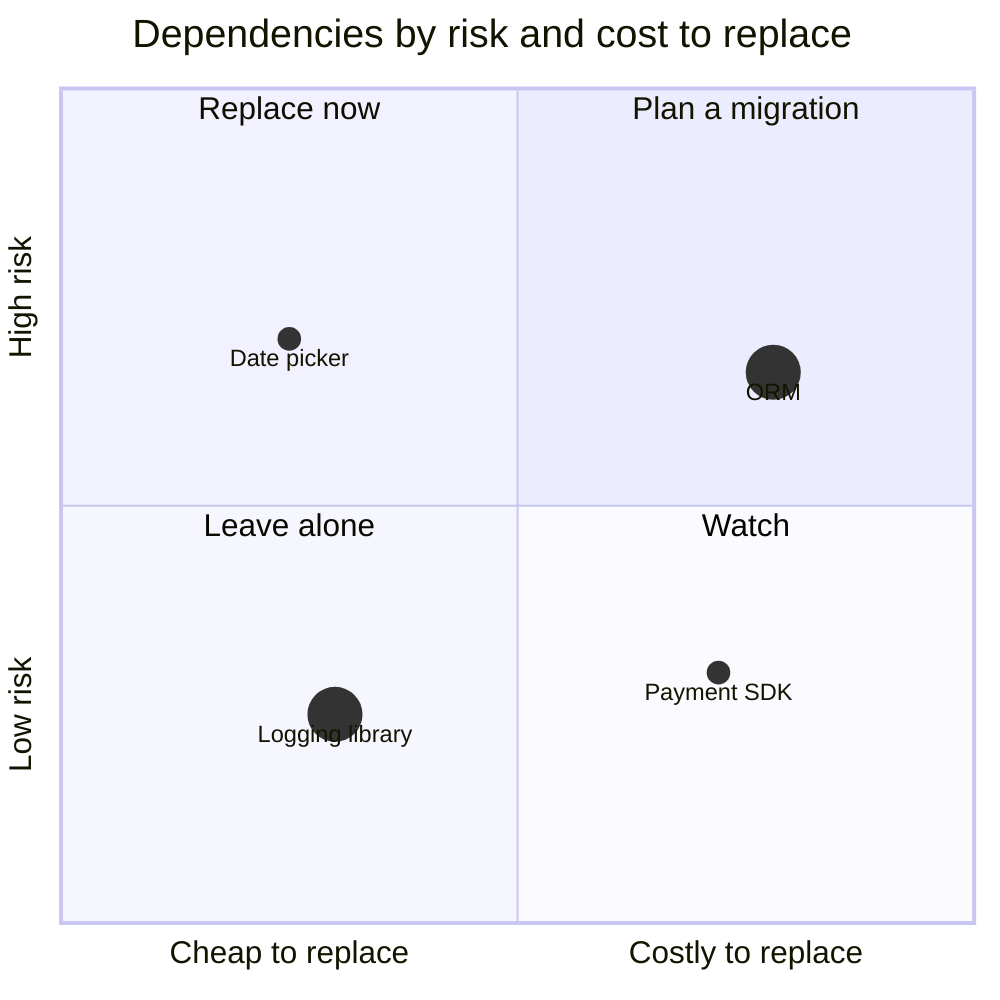

## Backlog by effort and impact

```mermaid
quadrantChart
    title Backlog by effort and impact
    x-axis Low effort --> High effort
    y-axis Low impact --> High impact
    quadrant-1 Plan carefully
    quadrant-2 Do next
    quadrant-3 Fill gaps
    quadrant-4 Avoid
    Saved searches: [0.22, 0.76]
    Fix flaky tests: [0.3, 0.58]
    SSO for teams: [0.72, 0.78]
    Rewrite billing: [0.8, 0.64]
    Dark mode: [0.25, 0.3]
    Onboarding tour: [0.7, 0.24]
```

## Point sizes for on-call alerts

```mermaid
quadrantChart
    title On-call alerts by noise and value
    x-axis Rarely fires --> Fires often
    y-axis Low value --> High value
    quadrant-1 Tune the threshold
    quadrant-2 Keep
    quadrant-3 Review
    quadrant-4 Delete
    Certificate expiring: [0.24, 0.8] radius: 5
    Disk almost full: [0.3, 0.62] radius: 8
    p99 latency: [0.72, 0.7] radius: 14
    Pod restarted: [0.62, 0.3] radius: 10
    CPU above 80%: [0.84, 0.17] radius: 14
```

## Point classes for dependencies

```mermaid
quadrantChart
    title Dependencies by risk and cost to replace
    x-axis Cheap to replace --> Costly to replace
    y-axis Low risk --> High risk
    quadrant-1 Plan a migration
    quadrant-2 Replace now
    quadrant-3 Leave alone
    quadrant-4 Watch
    Date picker:::few: [0.25, 0.7]
    ORM:::many: [0.78, 0.66]
    Logging library:::many: [0.3, 0.25]
    Payment SDK:::few: [0.72, 0.3]
    classDef many radius: 14
    classDef few radius: 6
```
