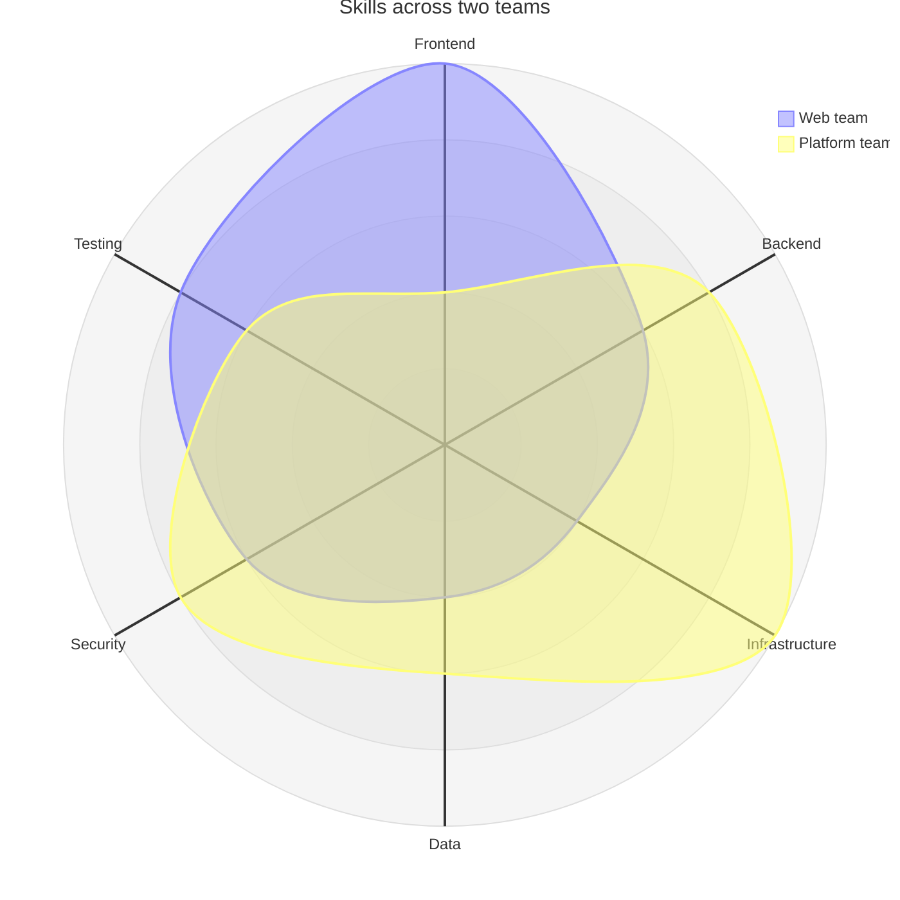
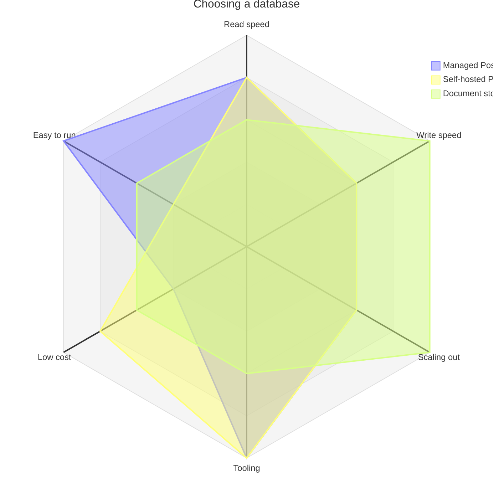
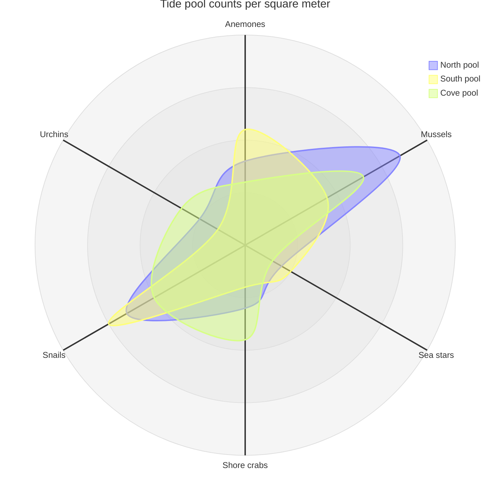

## Skills across two teams

```mermaid
radar-beta
    title Skills across two teams
    axis fe["Frontend"], be["Backend"], infra["Infrastructure"]
    axis data["Data"], sec["Security"], test["Testing"]
    curve web["Web team"]{5, 3, 2, 2, 3, 4}
    curve platform["Platform team"]{2, 4, 5, 3, 4, 3}
    max 5
    min 0
```

## Choosing a database

```mermaid
radar-beta
    title Choosing a database
    axis reads["Read speed"], writes["Write speed"], scale["Scaling out"]
    axis tools["Tooling"], cost["Low cost"], ops["Easy to run"]
    curve managed["Managed Postgres"]{4, 3, 3, 5, 2, 5}
    curve selfhosted["Self-hosted Postgres"]{4, 3, 3, 5, 4, 2}
    curve docs["Document store"]{3, 5, 5, 3, 3, 3}
    graticule polygon
    max 5
    min 0
```

## Tide pool survey

```mermaid
radar-beta
    title Tide pool counts per square meter
    axis anemones["Anemones"], mussels["Mussels"], stars["Sea stars"]
    axis crabs["Shore crabs"], snails["Snails"], urchins["Urchins"]
    curve north["North pool"]{16, 34, 8, 12, 26, 10}
    curve south["South pool"]{22, 18, 10, 8, 30, 6}
    curve cove["Cove pool"]{12, 26, 6, 18, 20, 14}
    ticks 4
    max 40
    min 0
```
