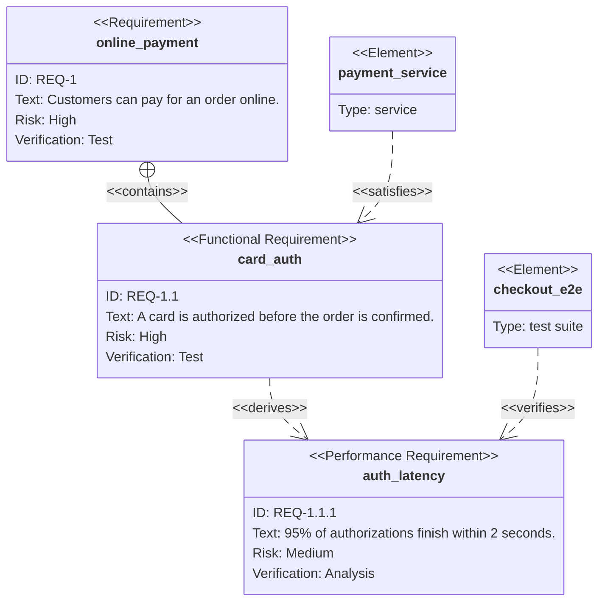
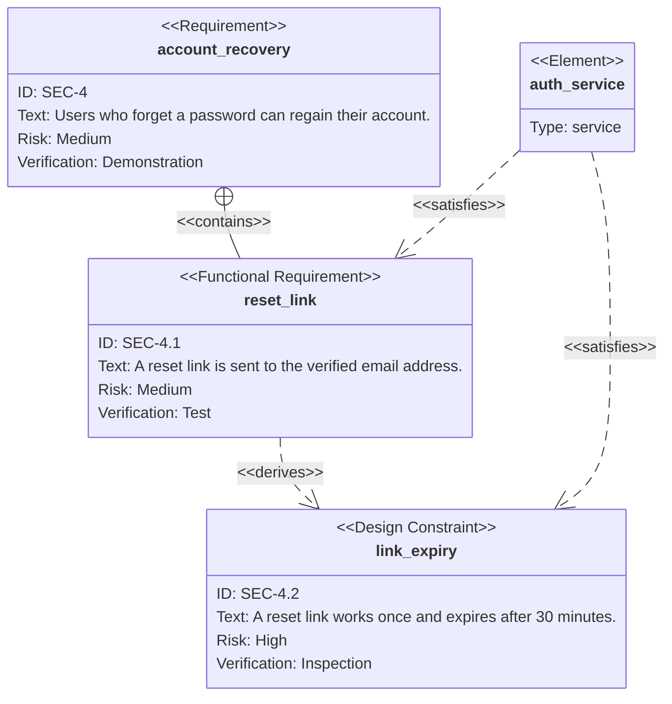
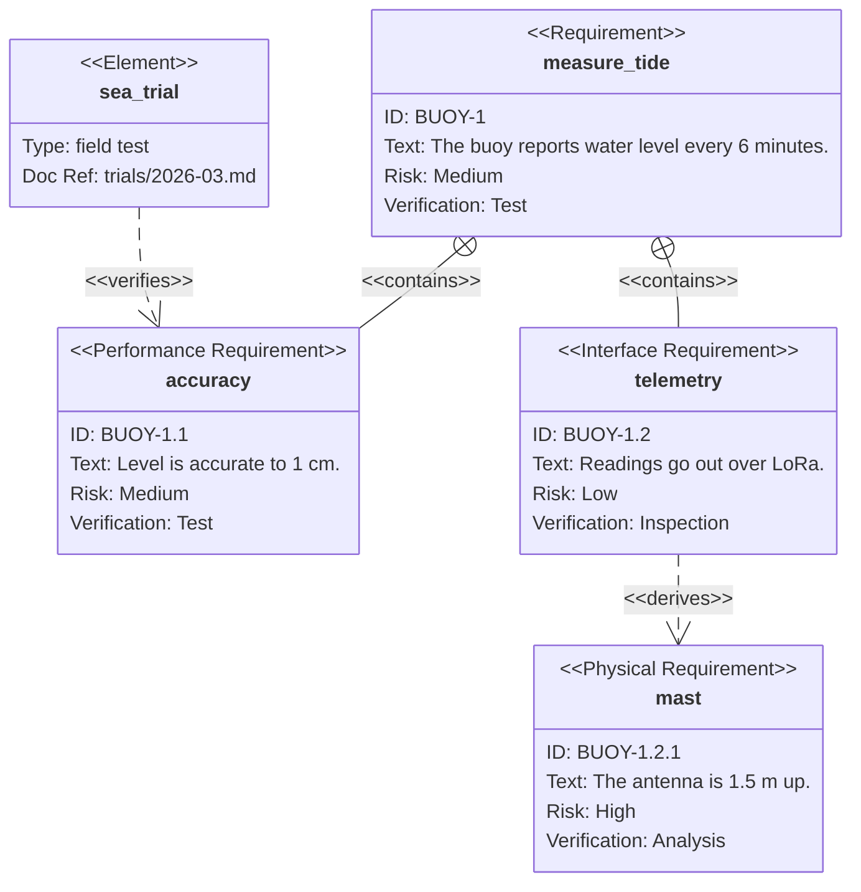

## Paying at checkout

```mermaid
requirementDiagram
    requirement online_payment {
        id: "REQ-1"
        text: Customers can pay for an order online.
        risk: high
        verifymethod: test
    }
    functionalRequirement card_auth {
        id: "REQ-1.1"
        text: A card is authorized before the order is confirmed.
        risk: high
        verifymethod: test
    }
    performanceRequirement auth_latency {
        id: "REQ-1.1.1"
        text: 95% of authorizations finish within 2 seconds.
        risk: medium
        verifymethod: analysis
    }
    element payment_service {
        type: service
    }
    element checkout_e2e {
        type: "test suite"
    }
    online_payment - contains -> card_auth
    card_auth - derives -> auth_latency
    payment_service - satisfies -> card_auth
    checkout_e2e - verifies -> auth_latency
```

## Resetting a password

```mermaid
requirementDiagram
    requirement account_recovery {
        id: "SEC-4"
        text: Users who forget a password can regain their account.
        risk: medium
        verifymethod: demonstration
    }
    functionalRequirement reset_link {
        id: "SEC-4.1"
        text: A reset link is sent to the verified email address.
        risk: medium
        verifymethod: test
    }
    designConstraint link_expiry {
        id: "SEC-4.2"
        text: A reset link works once and expires after 30 minutes.
        risk: high
        verifymethod: inspection
    }
    element auth_service {
        type: service
    }
    account_recovery - contains -> reset_link
    reset_link - derives -> link_expiry
    auth_service - satisfies -> reset_link
    auth_service - satisfies -> link_expiry
```

## A tide gauge buoy

```mermaid
requirementDiagram
    requirement measure_tide {
        id: "BUOY-1"
        text: The buoy reports water level every 6 minutes.
        risk: medium
        verifymethod: test
    }
    performanceRequirement accuracy {
        id: "BUOY-1.1"
        text: Level is accurate to 1 cm.
        risk: medium
        verifymethod: test
    }
    interfaceRequirement telemetry {
        id: "BUOY-1.2"
        text: Readings go out over LoRa.
        risk: low
        verifymethod: inspection
    }
    physicalRequirement mast {
        id: "BUOY-1.2.1"
        text: The antenna is 1.5 m up.
        risk: high
        verifymethod: analysis
    }
    element sea_trial {
        type: "field test"
        docRef: "trials/2026-03.md"
    }
    measure_tide - contains -> accuracy
    measure_tide - contains -> telemetry
    telemetry - derives -> mast
    sea_trial - verifies -> accuracy
```
