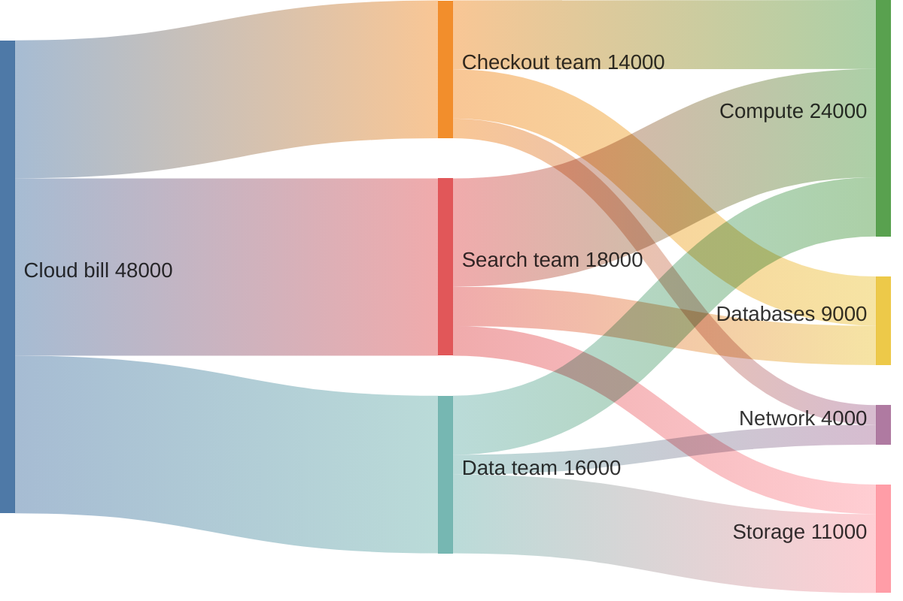
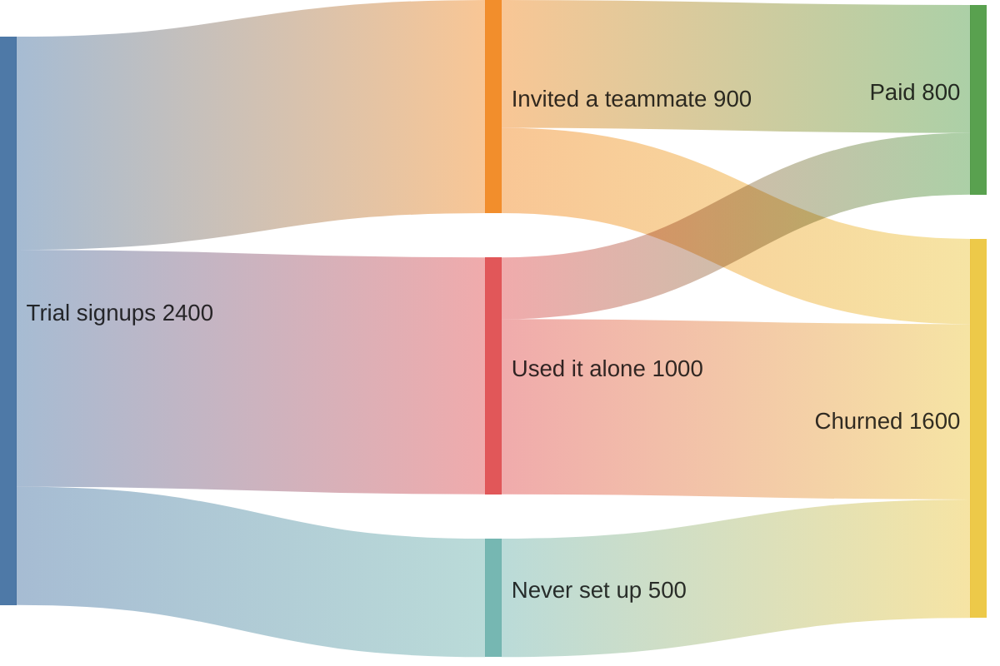
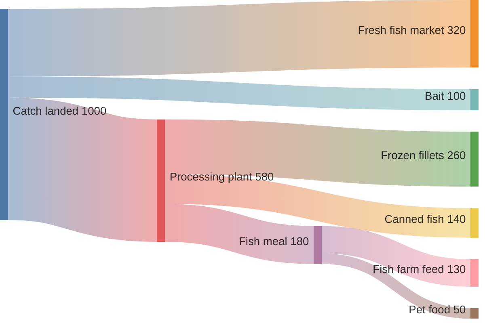
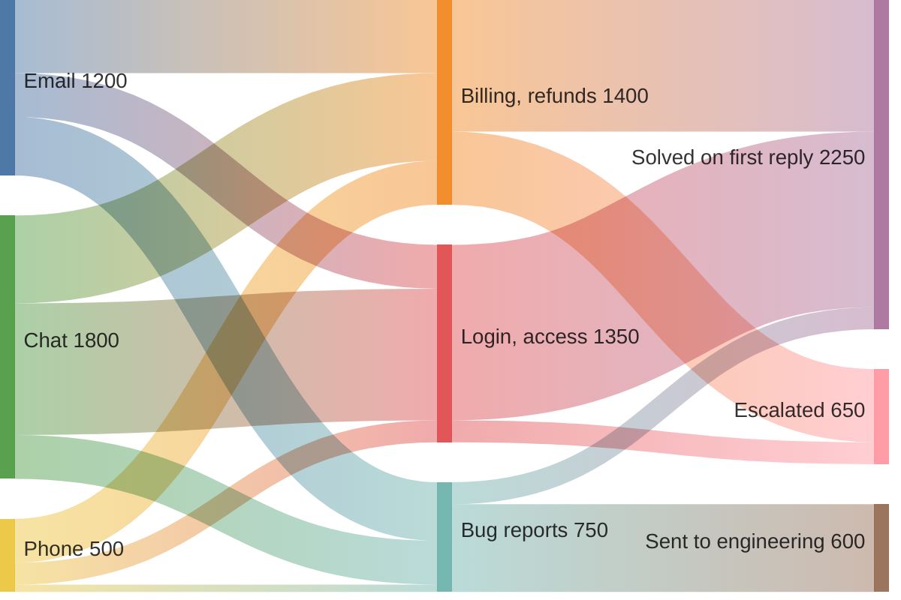

## Cloud bill by team and service

```mermaid
sankey

%% A month's cloud bill in dollars: who spends it, and on what
Cloud bill,Checkout team,14000
Cloud bill,Search team,18000
Cloud bill,Data team,16000
Checkout team,Compute,7000
Checkout team,Databases,5000
Checkout team,Network,2000
Search team,Compute,11000
Search team,Storage,3000
Search team,Databases,4000
Data team,Compute,6000
Data team,Storage,8000
Data team,Network,2000
```

## What became of trial signups

```mermaid
sankey

Trial signups,Invited a teammate,900
Trial signups,Used it alone,1000
Trial signups,Never set up,500
Invited a teammate,Paid,540
Invited a teammate,Churned,360
Used it alone,Paid,260
Used it alone,Churned,740
Never set up,Churned,500
```

## Where a fishing fleet's catch goes

```mermaid
sankey

%% Tonnes landed in one season
Catch landed,Fresh fish market,320
Catch landed,Processing plant,580
Catch landed,Bait,100
Processing plant,Frozen fillets,260
Processing plant,Canned fish,140
Processing plant,Fish meal,180
Fish meal,Fish farm feed,130
Fish meal,Pet food,50
```

## Support tickets by channel and topic

```mermaid
sankey

Email,"Billing, refunds",500
Email,"Login, access",300
Email,Bug reports,400
Chat,"Billing, refunds",600
Chat,"Login, access",900
Chat,Bug reports,300
Phone,"Billing, refunds",300
Phone,"Login, access",150
Phone,Bug reports,50
"Billing, refunds",Solved on first reply,900
"Billing, refunds",Escalated,500
"Login, access",Solved on first reply,1200
"Login, access",Escalated,150
Bug reports,Solved on first reply,150
Bug reports,Sent to engineering,600
```
