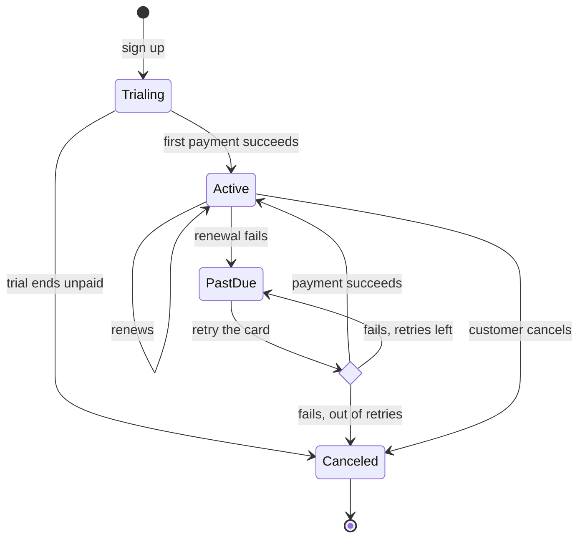
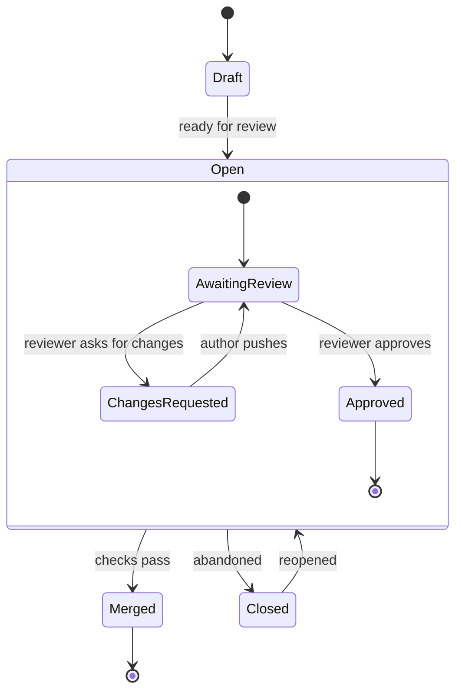
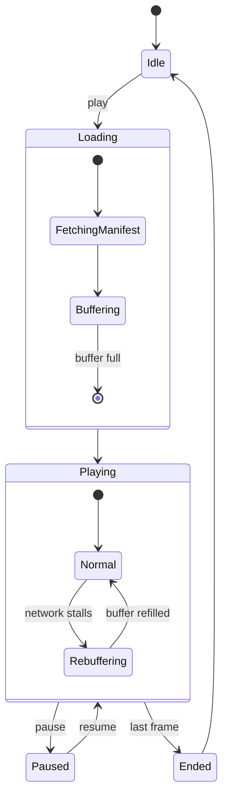
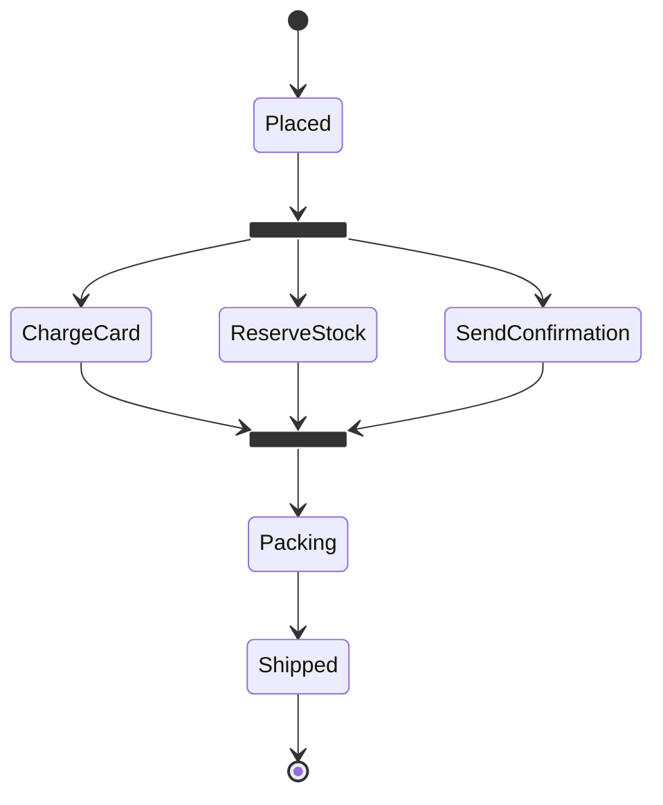
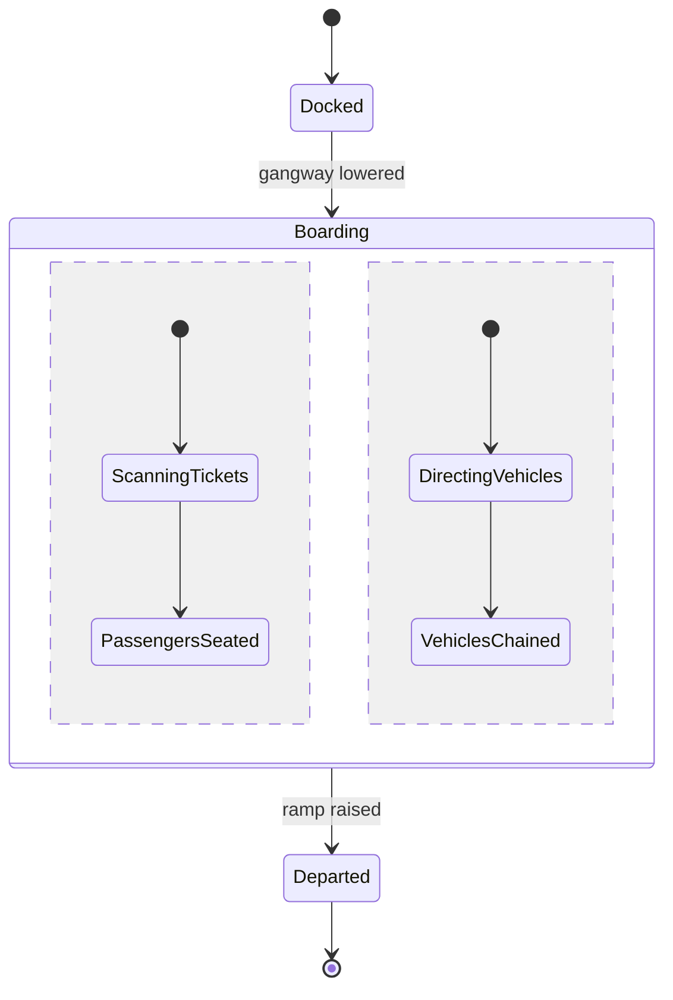
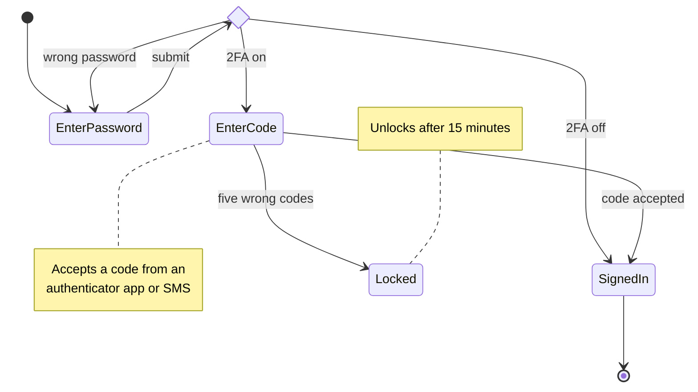

## A subscription's billing

```mermaid
stateDiagram-v2
    [*] --> Trialing : sign up
    Trialing --> Active : first payment succeeds
    Trialing --> Canceled : trial ends unpaid
    Active --> Active : renews
    state retry <<choice>>
    Active --> PastDue : renewal fails
    PastDue --> retry : retry the card
    retry --> Active : payment succeeds
    retry --> PastDue : fails, retries left
    retry --> Canceled : fails, out of retries
    Active --> Canceled : customer cancels
    Canceled --> [*]
```

## A pull request

```mermaid
stateDiagram-v2
    [*] --> Draft
    Draft --> Open : ready for review
    state Open {
        [*] --> AwaitingReview
        AwaitingReview --> ChangesRequested : reviewer asks for changes
        ChangesRequested --> AwaitingReview : author pushes
        AwaitingReview --> Approved : reviewer approves
        Approved --> [*]
    }
    Open --> Merged : checks pass
    Open --> Closed : abandoned
    Closed --> Open : reopened
    Merged --> [*]
```

## A video player

```mermaid
stateDiagram-v2
    [*] --> Idle
    Idle --> Loading : play
    state Loading {
        [*] --> FetchingManifest
        FetchingManifest --> Buffering
        Buffering --> [*] : buffer full
    }
    Loading --> Playing
    state Playing {
        [*] --> Normal
        Normal --> Rebuffering : network stalls
        Rebuffering --> Normal : buffer refilled
    }
    Playing --> Paused : pause
    Paused --> Playing : resume
    Playing --> Ended : last frame
    Ended --> Idle
```

## Fulfilling an order

```mermaid
stateDiagram-v2
    state fork_state <<fork>>
    state join_state <<join>>
    [*] --> Placed
    Placed --> fork_state
    fork_state --> ChargeCard
    fork_state --> ReserveStock
    fork_state --> SendConfirmation
    ChargeCard --> join_state
    ReserveStock --> join_state
    SendConfirmation --> join_state
    join_state --> Packing
    Packing --> Shipped
    Shipped --> [*]
```

## Boarding a ferry

```mermaid
stateDiagram-v2
    [*] --> Docked
    Docked --> Boarding : gangway lowered
    state Boarding {
        [*] --> ScanningTickets
        ScanningTickets --> PassengersSeated
        --
        [*] --> DirectingVehicles
        DirectingVehicles --> VehiclesChained
    }
    Boarding --> Departed : ramp raised
    Departed --> [*]
```

## Signing in with two-factor

```mermaid
stateDiagram-v2
    state check <<choice>>
    [*] --> EnterPassword
    EnterPassword --> check : submit
    check --> EnterPassword : wrong password
    check --> EnterCode : 2FA on
    check --> SignedIn : 2FA off
    EnterCode --> SignedIn : code accepted
    EnterCode --> Locked : five wrong codes
    note right of EnterCode
        Accepts a code from an
        authenticator app or SMS
    end note
    note left of Locked : Unlocks after 15 minutes
    SignedIn --> [*]
```
