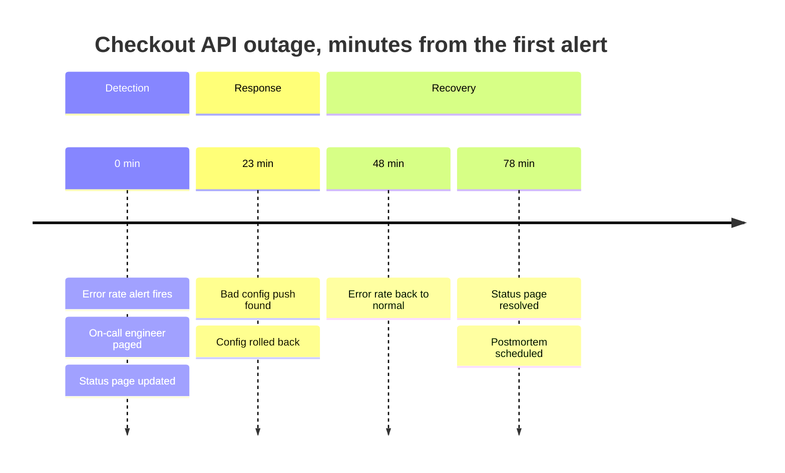
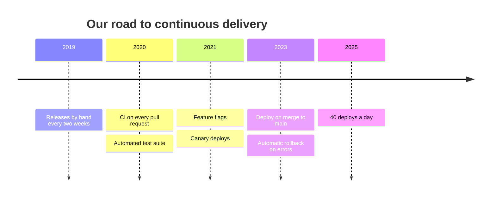
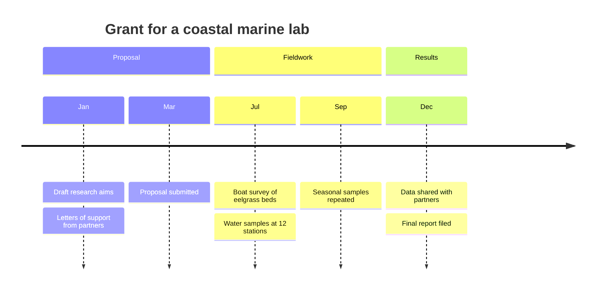

## Checkout API outage

```mermaid
timeline
    title Checkout API outage, minutes from the first alert
    section Detection
        0 min : Error rate alert fires
              : On-call engineer paged
              : Status page updated
    section Response
        23 min : Bad config push found : Config rolled back
    section Recovery
        48 min : Error rate back to normal
        78 min : Status page resolved : Postmortem scheduled
```

## Our road to continuous delivery

```mermaid
timeline
    title Our road to continuous delivery
    2019 : Releases by hand every two weeks
    2020 : CI on every pull request : Automated test suite
    2021 : Feature flags : Canary deploys
    2023 : Deploy on merge to main : Automatic rollback on errors
    2025 : 40 deploys a day
```

## Marine lab grant

```mermaid
timeline
    title Grant for a coastal marine lab
    section Proposal
        Jan : Draft research aims
            : Letters of support from partners
        Mar : Proposal submitted
    section Fieldwork
        Jul : Boat survey of eelgrass beds
            : Water samples at 12 stations
        Sep : Seasonal samples repeated
    section Results
        Dec : Data shared with partners
            : Final report filed
```
