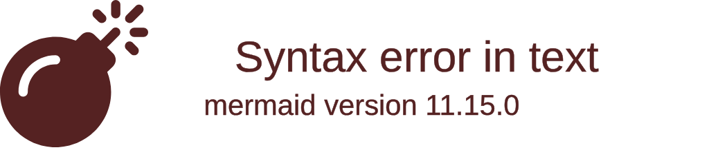

## A Go web service

```mermaid
treeView-beta
    orders-api/
        cmd/
            server/
                main.go ## starts the HTTP server
        internal/
            orders/
                handler.go :::highlight ## routes and JSON
                handler_test.go
                store.go ## Postgres queries
            config/
                config.go ## reads the environment
        migrations/
            0001_create_orders.sql
        go.mod
        go.sum
        Dockerfile
        README.md
```

## A monorepo, drawn with box characters

```mermaid
treeView-beta
storefront/
├── apps/
│   ├── web/
│   │   ├── src/
│   │   └── package.json
│   └── docs/
│       └── package.json
├── packages/
│   ├── ui/
│   │   └── package.json
│   └── tsconfig/
├── pnpm-workspace.yaml
└── turbo.json
```

## A tide pool survey's data, with notes

```mermaid
treeView-beta
    tide-pool-survey/
        data/
            raw/ ## as logged in the field
                2026-06-14_north-cove.csv
                2026-06-14_south-cove.csv
            clean/
                species_counts.parquet :::highlight ## one row per quadrat
        notebooks/
            01_clean.ipynb
            02_algae_cover.ipynb ## kelp and sea lettuce cover
        field-protocol.md
        environment.yml
```

## A Helm chart, with a title

```mermaid
treeView-beta
title Helm chart for the billing service
    billing/
        Chart.yaml ## name, version, dependencies
        values.yaml ## defaults an install can override
        values-prod.yaml
        templates/
            deployment.yaml
            service.yaml
            ingress.yaml
            _helpers.tpl
        charts/
```
