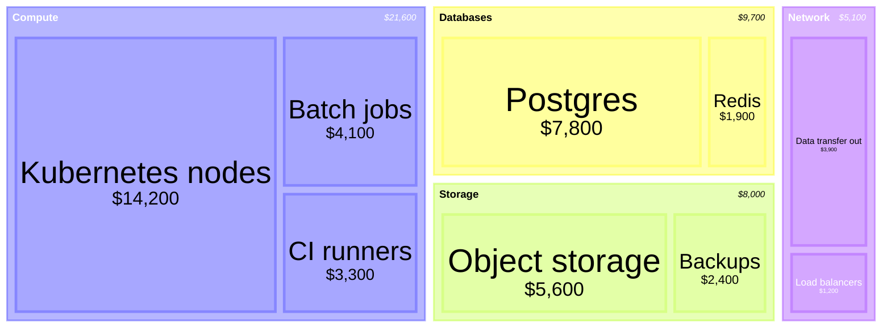
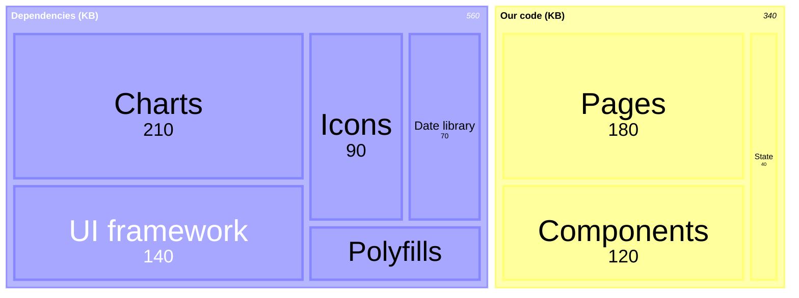
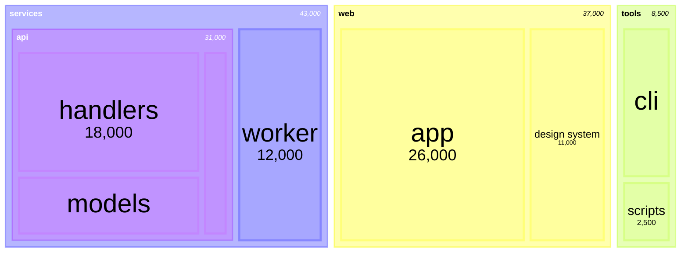

## A month of cloud costs

```mermaid
---
config:
  treemap:
    valueFormat: '$0,0'
---
treemap-beta
"Compute"
    "Kubernetes nodes": 14200
    "Batch jobs": 4100
    "CI runners": 3300
"Databases"
    "Postgres": 7800
    "Redis": 1900
"Storage"
    "Object storage": 5600
    "Backups": 2400
"Network"
    "Data transfer out": 3900
    "Load balancers": 1200
```

## What is in the JavaScript bundle

```mermaid
treemap-beta
"Our code (KB)"
    "Pages": 180
    "Components": 120
    "State": 40
"Dependencies (KB)"
    "UI framework": 140
    "Charts": 210
    "Date library": 70
    "Icons": 90
    "Polyfills": 50
```

## Monorepo by lines of code

```mermaid
treemap-beta
"services"
    "api"
        "handlers": 18000
        "models": 9000
        "migrations": 4000
    "worker": 12000
"web"
    "app": 26000
    "design system": 11000
"tools"
    "cli": 6000
    "scripts": 2500
```
