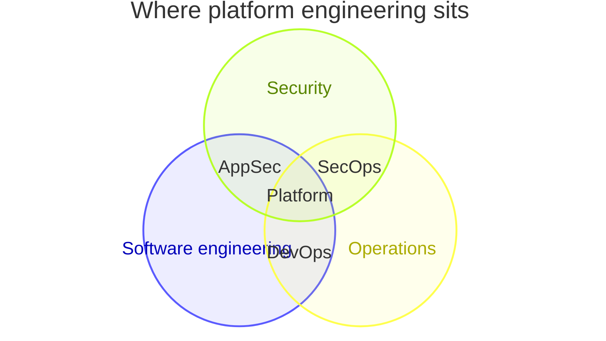
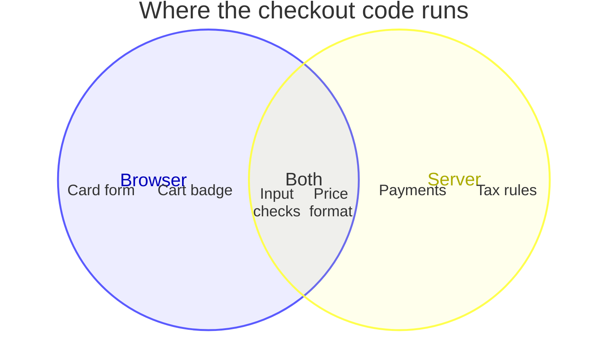
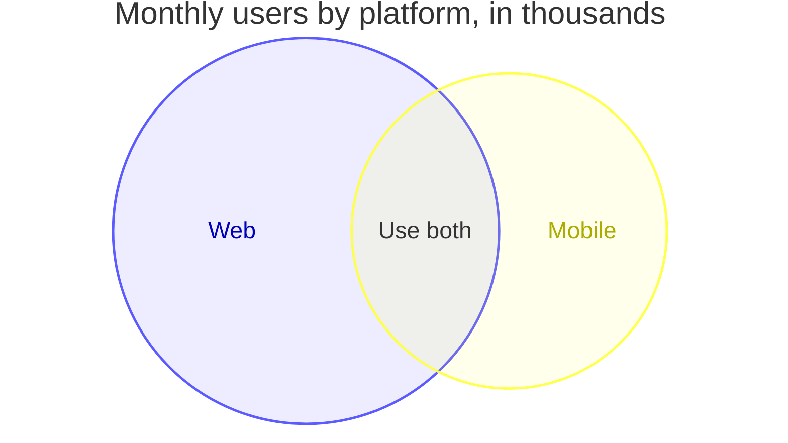

## Where platform engineering sits

```mermaid
venn-beta
    title Where platform engineering sits
    set Dev["Software engineering"]
    set Ops["Operations"]
    set Sec["Security"]
    union Dev,Ops["DevOps"]
    union Ops,Sec["SecOps"]
    union Dev,Sec["AppSec"]
    union Dev,Ops,Sec["Platform"]
```

## Where the checkout code runs

```mermaid
venn-beta
    title Where the checkout code runs
    set Browser
        text form["Card form"]
        text badge["Cart badge"]
    set Server
        text pay["Payments"]
        text tax["Tax rules"]
    union Browser,Server["Both"]
        text valid["Input checks"]
        text price["Price format"]
```

## Users by platform

```mermaid
venn-beta
    title Monthly users by platform, in thousands
    set Web:120
    set Mobile:80
    union Web,Mobile["Use both"]:30
```
