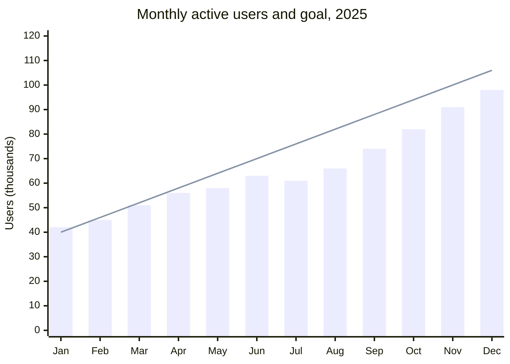
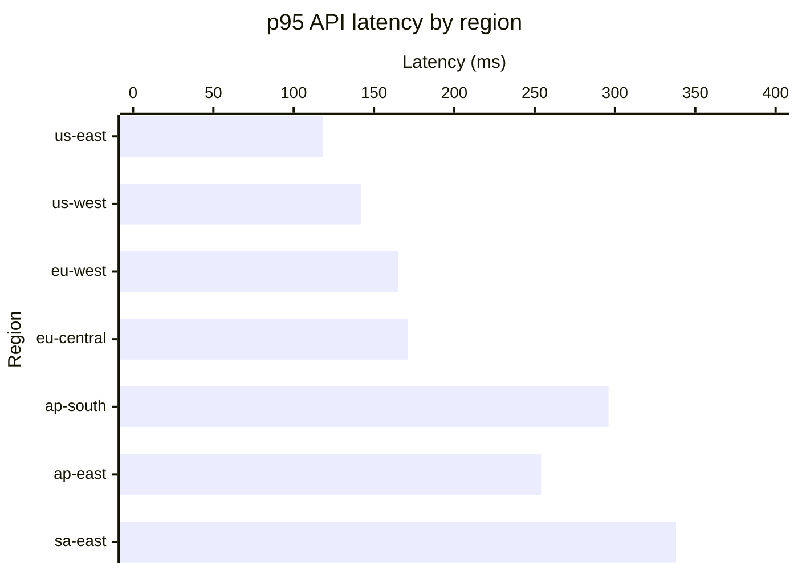
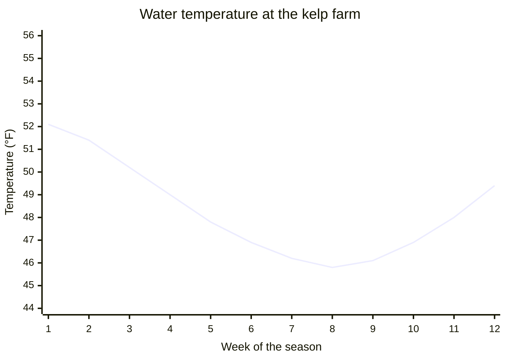
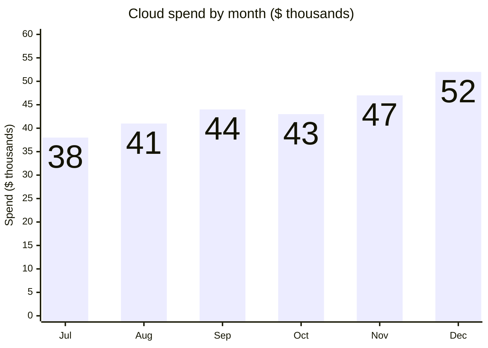

## Monthly active users

```mermaid
xychart
    title "Monthly active users and goal, 2025"
    x-axis [Jan, Feb, Mar, Apr, May, Jun, Jul, Aug, Sep, Oct, Nov, Dec]
    y-axis "Users (thousands)" 0 --> 120
    bar [42, 45, 51, 56, 58, 63, 61, 66, 74, 82, 91, 98]
    line [40, 46, 52, 58, 64, 70, 76, 82, 88, 94, 100, 106]
```

## p95 latency by region

```mermaid
xychart horizontal
    title "p95 API latency by region"
    x-axis "Region" [us-east, us-west, eu-west, eu-central, ap-south, ap-east, sa-east]
    y-axis "Latency (ms)" 0 --> 400
    bar [118, 142, 165, 171, 296, 254, 338]
```

## Water temperature at the kelp farm

```mermaid
xychart
    title "Water temperature at the kelp farm"
    x-axis "Week of the season" 1 --> 12
    y-axis "Temperature (°F)" 44 --> 56
    line [52.1, 51.4, 50.2, 49.0, 47.8, 46.9, 46.2, 45.8, 46.1, 46.9, 48.0, 49.4]
```

## Cloud spend by month

```mermaid
---
config:
    xyChart:
        showDataLabel: true
---
xychart
    title "Cloud spend by month ($ thousands)"
    x-axis [Jul, Aug, Sep, Oct, Nov, Dec]
    y-axis "Spend ($ thousands)" 0 --> 60
    bar [38, 41, 44, 43, 47, 52]
```
